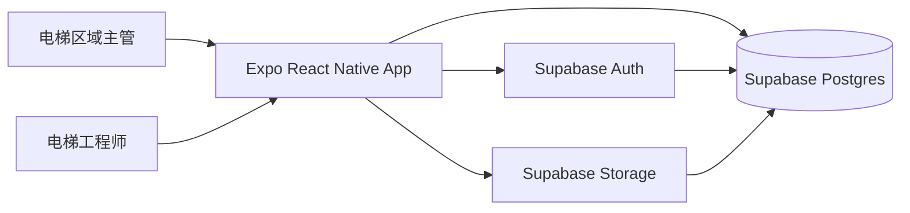
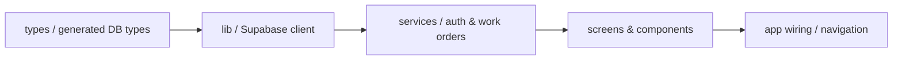
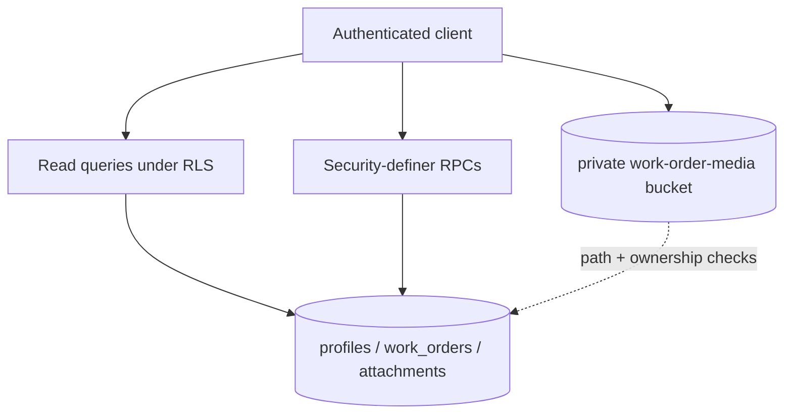

# Architecture

版本：0.2

日期：2026-07-25

状态：实现前基线

## 目标

用最少层级交付可在 Android 与 iOS 真机运行的 Expo 应用，同时让角色权限、状态流转和数据契约可被代码与数据库共同验证。

## 系统边界



V1 没有自建 Node API。Supabase 是唯一后端；Expo App 通过 `supabase-js` 调用查询、RPC 和私有文件存储。

## 客户端依赖方向



只能沿箭头正向依赖：

- `types` 不依赖运行时代码。
- `lib` 只负责初始化 Supabase、环境变量和通用错误映射。
- `services` 封装查询、Storage 和 RPC；不含 UI。
- `screens/components` 只调用 service，不直接写 SQL/RPC 参数拼装逻辑。
- `app wiring` 负责 session、角色路由和主题。

## 后端边界



- 普通读取由 RLS 约束。
- 创建、改派、开始处理和关闭使用 RPC，集中验证角色、状态和乐观锁版本。
- Storage 使用私有 bucket；对象路径携带上传者与工单 ID，读取权限与工单可见性一致。

## 关键不变量

1. 每个业务用户对应一个 `auth.users` 和一个 `profiles`。
2. 每个工单恰好有一个创建主管和一个当前工程师。
3. 每个工单有 1–3 个附件；附件不能跨工单复用。
4. 状态只能 `assigned -> in_progress -> closed`。
5. `closed` 工单必须同时存在 `resolution` 与 `closed_at`。
6. 只有主管能创建或改派；只有当前工程师能开始或关闭。
7. 所有状态写入携带 `expected_version`，并发冲突返回而不是覆盖。

## 目标目录

```text
.
├── AGENTS.md
├── CLAUDE.md
├── ARCHITECTURE.md
├── README.md
├── app/                         # Expo Router screens
├── src/
│   ├── components/
│   ├── lib/
│   ├── services/
│   └── types/
├── supabase/
│   ├── migrations/              # Schema 事实源
│   └── tests/                   # pgTAP
├── __tests__/                   # unit/component/router
├── tests/                       # Supabase integration + fixtures
├── .maestro/                    # Android/iOS E2E flows
├── .eas/workflows/              # EAS E2E gates
├── design-system/
├── docs/
│   ├── README.md                # 知识索引
│   ├── API_CONTRACT.md          # 页面到 Supabase 接口契约
│   ├── TESTING.md               # 测试事实源
│   └── ai-chat-history.jsonl
└── prototype/
```

这是单一 Git 仓库。V1 只计划一个 JavaScript 应用，不增加 workspace
编排工具；只有实际需要时才创建目录，不为未来功能预建空抽象。

## 漂移防护

- `AGENTS.md` 是通用地图和硬约束；`CLAUDE.md` 只导入它，不维护副本。
- `docs/README.md` 记录事实源、状态和验证证据；状态不能脱离证据升级。
- schema 变更顺序固定为：更新 PRD/后端文档 → migration → 生成类型 → service → UI → 验证。
- Service 或接口变更必须先更新 `docs/API_CONTRACT.md`，再同步后端 migration、生成类型和前端调用。
- 首个应用 scaffold 必须提供单一 `npm run verify`；完整门禁见 `docs/TESTING.md`。
- 结构性约束优先用 TypeScript、Postgres constraint、RLS 和测试执行，不依赖文字提醒。

这些约束采用 OpenAI [Harness engineering](https://openai.com/index/harness-engineering/) 的核心做法：仓库内知识作为事实源、短 `AGENTS.md` 作为地图、渐进式披露，以及把重要不变量升级为可机械验证的规则。

## 决策记录

| 决策 | 选择 | 原因 |
| --- | --- | --- |
| 移动端 | Expo + TypeScript | 满足 Android/iOS 与无需本地双端工具链的要求。 |
| 开发客户端 | Expo development build | 不使用 Expo Go，可加载真实原生配置。 |
| 后端 | Supabase | 一体化提供真实认证、Postgres、RLS 与照片存储。 |
| API | Supabase query + RPC | V1 无需额外 Node 服务；关键写入仍有服务端边界。 |
| 状态管理 | Auth context + screen-local server state | 当前规模不需要 Redux。 |
