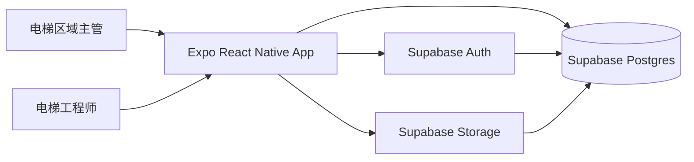
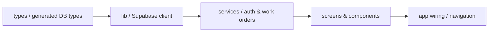
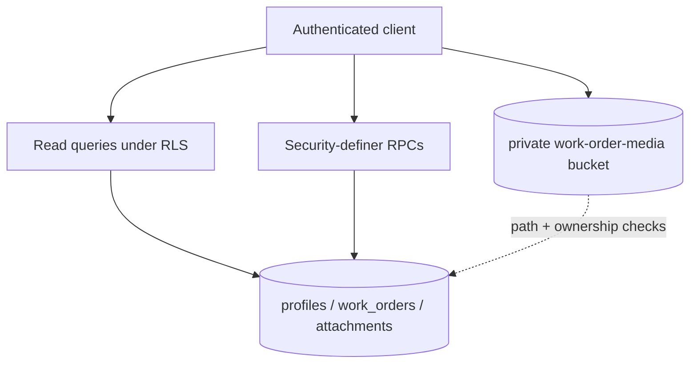

# Architecture

版本：0.5

日期：2026-07-25

状态：P0/P1 已实现；P2 双平台测试构建、Auth/profile smoke 与 iOS Maestro 完整关键流已验证；DB/RLS/低权限集成与 Mailpit/PKCE 已由 GitHub CI 验证。iOS 26 原生导航兼容补丁已固定；当前 Release 原生产物已通过三条 iOS Flow，待 Android（用户当前不具备设备）与真机 UAT 证据

## 目标

用最少层级交付可在 Android 与 iOS 真机运行的 Expo 应用，同时让角色权限、状态流转和数据契约可被代码与数据库共同验证。

## 系统边界



V1 没有自建 Node API。Supabase 是唯一后端；Expo App 通过 `supabase-js` 调用查询、RPC 和私有文件存储。

## 客户端依赖方向



只能沿箭头正向依赖：

- `types` 不依赖运行时代码。
- `lib` 只负责初始化 Supabase、环境变量和通用错误映射。
- `services` 封装查询、Storage 和 RPC；不含 UI。
- `screens/components` 只调用 service，不直接写 SQL/RPC 参数拼装逻辑。
- `app wiring` 负责 session、角色路由和主题。

## 后端边界



- 普通读取由 RLS 约束。
- 创建、改派、开始处理和关闭使用 RPC，集中验证角色、状态和乐观锁版本。
- Storage 使用私有 bucket；对象路径携带上传者与工单 ID，读取权限与工单可见性一致。

## 关键不变量

1. 每个业务用户对应一个 `auth.users` 和一个 `profiles`。
2. 每个工单恰好有一个创建主管和一个当前工程师。
3. 每个工单有 1–3 个附件；附件不能跨工单复用。
4. 状态只能 `assigned -> in_progress -> closed`。
5. `closed` 工单必须同时存在 `resolution` 与 `closed_at`。
6. 只有主管能创建或改派；只有当前工程师能开始或关闭。
7. 所有状态写入携带 `expected_version`，并发冲突返回而不是覆盖。

## 目标目录

```text
.
├── AGENTS.md
├── CLAUDE.md
├── ARCHITECTURE.md
├── README.md
├── app/                         # Expo Router screens
├── src/
│   ├── components/
│   ├── lib/
│   ├── services/
│   └── types/
├── supabase/
│   ├── migrations/              # Schema 事实源
│   └── tests/                   # pgTAP
├── __tests__/                   # unit/component/router
├── tests/                       # Supabase integration + fixtures
├── .maestro/                    # Android/iOS E2E flows
├── .eas/workflows/              # EAS E2E gates
├── design-system/
├── docs/
│   ├── README.md                # 知识索引
│   ├── API_CONTRACT.md          # 页面到 Supabase 接口契约
│   ├── TESTING.md               # 测试事实源
│   └── ai-chat-history.jsonl
└── prototype/
```

这是单一 Git 仓库。V1 只计划一个 JavaScript 应用，不增加 workspace
编排工具；只有实际需要时才创建目录，不为未来功能预建空抽象。

## 开发优先级与并行边界

优先级表示实现顺序，不表示可裁剪范围；P2 仍是交付前必做。具体字段、页面、接口和测试
分别以 `BACKEND.md`、`FRONTEND.md`、`API_CONTRACT.md` 和 `TESTING.md` 为准，本表不复制契约。

| 优先级 | 后端 | 前端 | 依赖与完成条件 |
| --- | --- | --- | --- |
| P0 工程与安全基线 | 建立 Auth/profile、核心 schema/constraint、最小 RLS、seed；生成数据库类型 | 建立 Expo Router、Supabase 单例、session/profile 恢复、登录和角色路由 | 先固定 `API_CONTRACT.md`；migration 可从空库重放，生成类型一致，主管/工程师真实账号可登录，匿名和停用账号被服务端拒绝，`verify` 基线可执行 |
| P1 业务闭环 | 完成查询、写 RPC、Storage policy、幂等与乐观锁，并覆盖 pgTAP/低权限集成测试 | 完成列表、建单上传、详情、改派、开始、关闭和密码重置；所有操作只调用 Service | 后端每稳定一组接口并更新生成类型，前端即可联调该组；主管建单至工程师关闭的主流程通过组件、数据库和集成测试，失败路径无脏数据 |
| P2 双端交付 | 固化 E2E 测试项目、数据准备/清理与验证证据 | 完成双端系统相册、深链、无障碍、错误恢复和构建配置验证 | 仅在 P1 前后端闭环后执行完整 Maestro；Android/iOS 构建可安装，密码重置与跨设备 UAT 通过，全部 PRD 验收 ID 有证据 |

可并行边界：

- P0 契约固定后，后端 migration/RLS 与前端路由、页面结构、Service mock 可并行；真实
  Service 联调必须等待对应 migration、RPC 和生成类型落地。
- P1 按 `Auth/Profile`、工单读取、工单写入、Storage 四组纵向切片推进；每组以后端契约测试
  通过和生成类型更新作为前端联调入口，不等待全部后端完成。
- 测试用例与 Maestro flow 可依据 PRD 和接口契约并行编写，但真实集成、E2E 和 UAT 只能在
  对应前后端切片及确定 seed 可用后通过。
- 任何并行分支修改字段、RPC、错误码或页面行为时，必须先更新其唯一事实源；不得用临时
  第二套类型或接口绕过依赖。

## 漂移防护

- `AGENTS.md` 是通用地图和硬约束；`CLAUDE.md` 只导入它，不维护副本。
- `docs/README.md` 记录事实源、状态和验证证据；状态不能脱离证据升级。
- schema 变更顺序固定为：更新 PRD/后端文档 → migration → 生成类型 → service → UI → 验证。
- Service 或接口变更必须先更新 `docs/API_CONTRACT.md`，再同步后端 migration、生成类型和前端调用。
- 首个应用 scaffold 必须提供单一 `pnpm run verify`；完整门禁见 `docs/TESTING.md`。
- 结构性约束优先用 TypeScript、Postgres constraint、RLS 和测试执行，不依赖文字提醒。

这些约束采用 OpenAI [Harness engineering](https://openai.com/index/harness-engineering/) 的核心做法：仓库内知识作为事实源、短 `AGENTS.md` 作为地图、渐进式披露，以及把重要不变量升级为可机械验证的规则。

## 决策记录

| 决策 | 选择 | 原因 |
| --- | --- | --- |
| 移动端 | Expo + TypeScript | 满足 Android/iOS 与无需本地双端工具链的要求。 |
| 开发客户端 | Expo development build | 不使用 Expo Go，可加载真实原生配置。 |
| 后端 | Supabase | 一体化提供真实认证、Postgres、RLS 与照片存储。 |
| API | Supabase query + RPC | V1 无需额外 Node 服务；关键写入仍有服务端边界。 |
| 状态管理 | Auth context + screen-local server state | 当前规模不需要 Redux。 |

## 变更记录

| 日期 | 修改人 | 摘要 |
| --- | --- | --- |
| 2026-07-30 | Codex | 当前源码以本地 Xcode Release Simulator 原生产物通过 Maestro 登录、失效重置与完整派工闭环；测试后已复核清理 0 张 `E2E-*` 工单和 0 个附件。GitHub Verify #30474985934（功能提交）及 #30475418136（文档提交）均完成 DB/RLS/低权限集成与 Mailpit/PKCE。 |
| 2026-07-29 | Codex | 在 iOS 26.5 Simulator 以当前导出的 Hermes bundle 通过登录、失效重置与完整 `critical-journey.yml`；修复 Expo Router 冷启动先消费 recovery deep link、表单键盘遮挡后续自动化操作以及系统保存密码弹窗时序。 |
| 2026-07-29 | Codex | `react-native-screens` 精确固定 4.26.2，并保留 iOS 26 快照 guard；Cloud iOS 18.2 旧 binary 在新建页退出，草稿 UUID 改为不依赖 Hermes 全局或额外原生模块的兼容实现后必须以完整 Maestro 闭环复验。 |
| 2026-07-28 | Codex | 尝试切换 JS Stack 及禁用 inactive screen detach，仍由外层原生 Stack 触发相同快照崩溃，已回退该未验证兼容措施。 |
| 2026-07-28 | Codex | iOS Maestro 登录与失效重置已通过；派工闭环在 iOS 26 原生 Screen Stack 快照崩溃，未标记为 P2 通过。 |
| 2026-07-28 | Codex | 三组公开内部演示账号已通过 Auth/profile smoke；未将该结果扩大为原生业务流验收。 |
| 2026-07-28 | Codex | 审校外部证据：双平台 `e2e-test` 构建及 iOS Simulator 冷启动完成；Maestro、真实登录与跨设备 UAT 仍待验证。 |
| 2026-07-27 | Codex | 关联 EAS 项目并固化 owner/projectId；环境变量与外部构建仍待验证。 |
| 2026-07-25 | Codex | 落盘 P2 EAS 双平台测试构建、Maestro 主流程与 UAT 证据模板；未声明外部构建已通过。 |
| 2026-07-25 | Codex | P0/P1 前后端按契约落地；保留数据库集成、E2E 与双端构建验证缺口。 |
| 2026-07-25 | Codex | 增加前后端 P0/P1/P2 开发顺序、并行边界与阶段完成条件。 |
