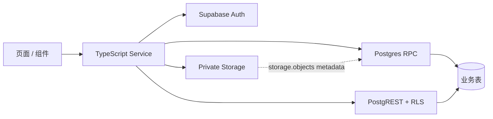

# 前后端对接契约

版本：0.1

日期：2026-07-25

状态：实现前基线

适用：Expo App ↔ Supabase Auth / PostgREST / RPC / Storage

## 1. 目的与边界

本文是“前端哪个功能调用哪个后端接口”的唯一事实源。`FRONTEND.md` 定义页面与交互，
`BACKEND.md` 定义数据库实现与权限；两者不得复制或改写本文的接口名称、参数、响应和错误语义。

V1 没有自建 HTTP/Node API。本文中的“接口”包括：

- Supabase Auth SDK 方法；
- 受 RLS 保护的 PostgREST 查询；
- Postgres RPC；
- 私有 Supabase Storage API。

前端页面只能调用 `src/services/` 暴露的方法，不能直接拼接 Supabase 查询、RPC 参数或
Storage 路径。

## 2. 调用分层



- 读：`profiles`、`work_orders`、`work_order_attachments` 查询，权限由 RLS 决定。
- 写：创建、改派、开始、关闭只允许 RPC；业务表没有客户端直写 policy。
- 文件：上传、读取和补偿删除只使用 Storage SDK；禁止直接修改 `storage` schema。
- Service 成功时返回 camelCase 业务类型；失败时抛出统一 `AppError`。

## 3. 功能到后端接口总表

| 前端页面 / 功能 | Service 方法 | 后端接口 | 成功结果 | 失败处理 |
| --- | --- | --- | --- | --- |
| App 启动恢复登录 | `AuthService.restoreSession()` | `AUTH-01` + `QRY-01` | `AuthContext` 或 `null` | session/profile 无效则本机退出并进入登录页 |
| 监听认证状态 | `AuthService.subscribe()` | `AUTH-02` | auth event | App 根节点卸载时 unsubscribe |
| 邮箱密码登录 | `AuthService.signIn(input)` | `AUTH-03` + `QRY-01` | `AuthContext` | 错误凭据、停用账号或网络错误 |
| 忘记密码 | `AuthService.requestPasswordReset(email)` | `AUTH-04` | 无论邮箱是否存在都显示统一成功提示 | 限流时提示稍后再试 |
| 打开重置邮件深链 | `AuthService.consumePasswordRecoveryUrl(url)` | `AUTH-05` | 建立 recovery session 并进入重设页 | token 缺失/失效时重新发邮件 |
| 提交新密码 | `AuthService.completePasswordReset(password)` | `AUTH-06` | 密码更新，返回登录页 | recovery session 失效时重新发邮件 |
| 个人中心退出 | `AuthService.signOut()` | `AUTH-07` | 清理本机 session | 本地状态始终清理；记录远端错误 |
| 个人中心显示资料 | `ProfileService.getCurrent()` | `QRY-01` | 当前 `Profile` | 缺 profile / 停用时退出 |
| 主管工单总览 | `WorkOrderService.list(input)` | `QRY-02` | 分页 `WorkOrderPage` | 保留旧列表并显示重试 |
| 工程师“我的工单” | `WorkOrderService.list(input)` | `QRY-02` | RLS 过滤后的分页结果 | 不接受其他工程师 ID 参数 |
| 下拉刷新 / 页面聚焦 | `WorkOrderService.list({ page: 0 })` | `QRY-02` | 替换列表并更新 `fetchedAt` | 保留旧数据和上次更新时间 |
| 工单详情 | `WorkOrderService.getById(id)` | `QRY-03` + `STO-02` | `WorkOrderDetail` + 临时图片 URL | 不存在与无权限使用同一页面 |
| 新建页加载工程师 | `ProfileService.listActiveEngineers()` | `RPC-01` | `EngineerOption[]` | 无权限返回列表；网络失败可重试 |
| 选择并提交现场照片 | `WorkOrderService.create(input)` | `STO-01` → `RPC-02` | 新建 `assigned` 工单 | 明确失败执行补偿；结果未知重放同一 ID |
| 取消新建 / 上传失败 | Service 内部补偿 | `STO-03` | 已上传草稿对象被删除 | 清理失败明确提示，不静默成功 |
| 主管改派 | `WorkOrderService.reassign(input)` | `RPC-03` | 新接手人和新版本号 | 非 `assigned` / 版本冲突后刷新详情 |
| 工程师开始处理 | `WorkOrderService.start(input)` | `RPC-04` | `in_progress` 和新版本号 | 越权 / 版本冲突后刷新详情 |
| 工程师关闭工单 | `WorkOrderService.close(input)` | `RPC-05` | `closed`、处理结果和新版本号 | 空结果不发请求；冲突后刷新 |

V1 不提供注册、工单删除、直接编辑工单、直接更新 profile 或直接写业务表的 Service
方法。

建议直接落地为以下文件，不增加通用 repository 或 API client 层：

```text
src/
├── lib/
│   ├── supabase.ts
│   └── map-supabase-error.ts
└── services/
    ├── auth.service.ts
    ├── profile.service.ts
    └── work-order.service.ts
```

## 4. 前端公共类型

实现时数据库原始类型由 Supabase schema 生成；以下是 Service 向 UI 暴露的业务类型。

```ts
type UUID = string;
type IsoDateTime = string;
type UserRole = 'elevator_supervisor' | 'elevator_engineer';
type WorkOrderStatus = 'assigned' | 'in_progress' | 'closed';
type WorkOrderPriority = 'normal' | 'urgent';
type AuthEvent =
  | 'INITIAL_SESSION'
  | 'SIGNED_IN'
  | 'SIGNED_OUT'
  | 'PASSWORD_RECOVERY'
  | 'TOKEN_REFRESHED'
  | 'USER_UPDATED';

type AuthStateListener = (event: AuthEvent, hasSession: boolean) => void;

interface Profile {
  id: UUID;
  displayName: string;
  role: UserRole;
  isActive: boolean;
}

interface AuthContext {
  userId: UUID;
  email: string;
  profile: Profile;
}

interface UserSummary {
  id: UUID;
  displayName: string;
}

type EngineerOption = UserSummary;

interface WorkOrderListItem {
  id: UUID;
  elevatorArea: string;
  elevatorCode: string;
  description: string;
  priority: WorkOrderPriority;
  status: WorkOrderStatus;
  assignee: EngineerOption;
  version: number;
  createdAt: IsoDateTime;
  updatedAt: IsoDateTime;
}

interface WorkOrderAttachment {
  id: UUID;
  storagePath: string;
  mimeType: 'image/jpeg';
  sizeBytes: number;
  position: 0 | 1 | 2;
  signedUrl: string | null;
  signedUrlExpiresAt: IsoDateTime | null;
}

interface WorkOrderDetail extends WorkOrderListItem {
  createdBy: UserSummary;
  assigneeId: UUID;
  resolution: string | null;
  startedAt: IsoDateTime | null;
  closedAt: IsoDateTime | null;
  attachments: WorkOrderAttachment[];
}

interface WorkOrderPage {
  items: WorkOrderListItem[];
  page: number;
  hasMore: boolean;
  fetchedAt: IsoDateTime;
}
```

`createdBy` 与 `assignee` 共用 `{ id, displayName }` 展示结构，但不表示创建人一定是工程师。

## 5. 统一错误类型

```ts
type AppErrorCode =
  | 'AUTH_REQUIRED'
  | 'AUTH_INVALID_CREDENTIALS'
  | 'AUTH_RATE_LIMITED'
  | 'AUTH_RECOVERY_EXPIRED'
  | 'ACCOUNT_DISABLED'
  | 'PROFILE_MISSING'
  | 'ROLE_FORBIDDEN'
  | 'NOT_FOUND_OR_FORBIDDEN'
  | 'VALIDATION_FAILED'
  | 'ENGINEER_INACTIVE'
  | 'ENGINEER_UNCHANGED'
  | 'PHOTO_COUNT_INVALID'
  | 'PHOTO_TYPE_INVALID'
  | 'PHOTO_SIZE_INVALID'
  | 'PHOTO_UPLOAD_FAILED'
  | 'PHOTO_OBJECT_MISSING'
  | 'PHOTO_CLEANUP_FAILED'
  | 'INVALID_TRANSITION'
  | 'RESOLUTION_REQUIRED'
  | 'VERSION_CONFLICT'
  | 'IDEMPOTENCY_CONFLICT'
  | 'NETWORK_ERROR'
  | 'TIMEOUT'
  | 'SERVER_ERROR';

interface AppError extends Error {
  code: AppErrorCode;
  retryable: boolean;
  field?: 'email' | 'password' | 'assigneeId' | 'photos' | 'resolution';
}
```

- UI 只判断 `AppError.code`，不解析 Supabase 原始英文 message。
- Service 保留原始错误到开发日志，但不得记录密码、token、图片内容或完整处理结果。
- 无法识别的 Auth/PostgREST/Storage/RPC 错误统一映射为 `SERVER_ERROR`。
- 网络中断映射为 `NETWORK_ERROR`；达到客户端等待上限映射为 `TIMEOUT`。

## 6. Auth 接口

### React Native client 初始化

Supabase client 只创建一次，使用 React Native 持久化 storage、`processLock` 和前台 token
刷新：

```ts
createClient(supabaseUrl, supabasePublishableKey, {
  auth: {
    storage: AsyncStorage,
    autoRefreshToken: true,
    persistSession: true,
    detectSessionInUrl: false,
    flowType: 'pkce',
    lock: processLock,
  },
})
```

AppState 进入 `active` 时调用 `startAutoRefresh()`，进入后台时调用
`stopAutoRefresh()`；监听器只注册一次。需要 `@react-native-async-storage/async-storage` 和
`react-native-url-polyfill`，分别用于 session 持久化与标准 URL API。V1 不另外包装认证 SDK。

### `AUTH-01` 恢复本地 session

Supabase：

```ts
supabase.auth.getSession()
```

流程：

1. 无 session：返回 `null`。
2. 有 session：调用 `QRY-01` 获取 profile。
3. profile 不存在或停用：执行 `signOut({ scope: 'local' })` 并抛出对应错误。
4. 成功：返回 `AuthContext`。

本地 session 只用于恢复 UI；所有服务端授权仍由 JWT、RLS 和 RPC 重新校验。

### `AUTH-02` 订阅认证事件

Supabase：

```ts
supabase.auth.onAuthStateChange(callback)
```

处理 `INITIAL_SESSION`、`SIGNED_IN`、`SIGNED_OUT`、`TOKEN_REFRESHED` 和
`USER_UPDATED`。原生 App 的 recovery URL 由 `AUTH-05` 主动处理，不能依赖浏览器自动解析。

### `AUTH-03` 邮箱密码登录

输入：

```ts
interface SignInInput {
  email: string;
  password: string;
}
```

Supabase：

```ts
supabase.auth.signInWithPassword({ email, password })
```

Auth 成功后必须调用 `QRY-01`。profile 缺失或停用时立刻执行本机退出，不能进入业务页面。
账号不存在与密码错误统一为 `AUTH_INVALID_CREDENTIALS`。

### `AUTH-04` 请求密码重置

Supabase：

```ts
supabase.auth.resetPasswordForEmail(email, {
  redirectTo: 'elevatorhandoff://reset-password',
})
```

为防止枚举账号，成功页面统一显示“如果邮箱已存在，重置邮件将会发送”。仅限流和网络错误显示失败。

### `AUTH-05` 消费密码重置深链

输入：完整 `elevatorhandoff://reset-password` URL。

1. 校验 scheme 与 `reset-password` route。
2. 从 query 读取一次性 `code`；缺失即 `AUTH_RECOVERY_EXPIRED`。
3. 调用：

```ts
supabase.auth.exchangeCodeForSession(code)
```

4. 成功后只进入重设密码页，不进入正常业务首页。
5. URL 和 code 不写日志、不写业务 state、不写聊天记录。

路由层同时处理冷启动初始 URL 和 App 已打开时的 URL event，并对同一 URL 去重。
PKCE code verifier 保存在发起重置的设备，因此邮件链接必须在同一设备打开；换设备或 code
超过有效期时提示在当前设备重新发送重置邮件。

### `AUTH-06` 完成密码重置

前置：`AUTH-05` 已成功建立 recovery session。

```ts
supabase.auth.updateUser({ password })
```

密码与确认密码必须完全一致且原始长度至少 8；密码不做 trim。更新成功后执行本机退出并
返回登录页，要求使用新密码重新登录。

### `AUTH-07` 退出登录

```ts
supabase.auth.signOut({ scope: 'local' })
```

V1 只退出当前设备，不默认踢出其他设备。无论远端调用是否成功，App 都清除内存中的
profile、页面数据和临时图片 URL。

## 7. PostgREST 读取接口

### `QRY-01` 当前 profile

表：`public.profiles`

Service 始终使用 `id = auth.uid()` 查询当前 profile。RLS 另允许工单关联查询读取最小人员
摘要：启用主管可读全部摘要；启用工程师只可读自己及分配给自己工单的创建主管。

```text
select id, display_name, role, is_active
where id = auth.uid()
maybeSingle()
```

0 行映射为 `PROFILE_MISSING`；`is_active = false` 映射为 `ACCOUNT_DISABLED`。
App 没有“人员目录”查询；主管选择工程师仍只能调用 `RPC-01`。

### `QRY-02` 工单列表

输入：

```ts
interface ListWorkOrdersInput {
  statuses?: readonly WorkOrderStatus[];
  page: number; // 从 0 开始
}
```

固定 `pageSize = 20`，每次请求 21 条用于计算 `hasMore`。`statuses` 省略表示全部；
工程师首页固定传 `['assigned', 'in_progress']`。不接受 `assigneeId`，工程师数据隔离完全由
RLS 决定。`page` 必须是大于等于 0 的整数；传入 `statuses` 时数组不得为空或包含重复值。

查询字段：

```text
work_orders:
  id, elevator_area, elevator_code, description, priority, status,
  assignee_id, version, created_at, updated_at
profiles via work_orders_assignee_id_fkey:
  id, display_name
```

排序与分页：

```text
priority DESC, created_at DESC, id DESC
range(page * 20, page * 20 + 20)
```

Service 返回前 20 条，若取到第 21 条则 `hasMore = true`。刷新必须从第 0 页重载；加载更多时
按 `id` 去重。PoC 使用 offset 分页，刷新期间出现的新工单可能导致页边界变化，因此不能把
“加载更多”结果当作快照。

### `QRY-03` 工单详情

输入：`id: UUID`。

查询字段：

```text
work_orders:
  id, elevator_area, elevator_code, description, priority, status,
  created_by, assignee_id, resolution, version,
  created_at, started_at, closed_at, updated_at
creator via work_orders_created_by_fkey:
  id, display_name
assignee via work_orders_assignee_id_fkey:
  id, display_name
work_order_attachments:
  id, storage_path, mime_type, size_bytes, position
```

使用 `id = input.id` + `maybeSingle()`。RLS 拒绝和记录不存在都得到 0 行，并统一映射为
`NOT_FOUND_OR_FORBIDDEN`，避免泄露工单是否存在。附件由 Service 按 `position` 排序，再为
每张图片调用 `STO-02`。

## 8. RPC 接口

所有 RPC：

- 只向 `authenticated` 授予 execute；
- 函数内部再次校验启用状态、角色、工单归属、状态和 `expected_version`；
- 使用 `security definer set search_path = ''`，所有对象写完整 schema；
- 业务异常使用 SQLSTATE `P0001`，`message` 为本文定义的业务 code；
- 未识别数据库异常不把 SQL、constraint 或堆栈返回 UI。

写 RPC 统一返回：

```ts
interface WorkOrderMutationResult {
  id: UUID;
  status: WorkOrderStatus;
  assigneeId: UUID;
  resolution: string | null;
  version: number;
  startedAt: IsoDateTime | null;
  closedAt: IsoDateTime | null;
  updatedAt: IsoDateTime;
}
```

数据库原始返回固定为：

```text
table(
  id uuid,
  status work_order_status,
  assignee_id uuid,
  resolution text,
  version integer,
  started_at timestamptz,
  closed_at timestamptz,
  updated_at timestamptz
)
```

Service 只做 snake_case → camelCase 映射，不推导或覆盖服务端值。
写 RPC 调用结果必须使用 `.single()` 并验证恰好一行；0 行或多行映射为 `SERVER_ERROR`。

### `RPC-01` `list_active_engineers()`

- 输入：无。
- 权限：启用主管。
- 返回：`table(id uuid, display_name text)`，按 `display_name ASC, id ASC`。
- 错误：`AUTH_REQUIRED`、`ACCOUNT_DISABLED`、`ROLE_FORBIDDEN`。

### `RPC-02` `create_work_order(...)`

前端输入：

```ts
interface CreateWorkOrderInput {
  id: UUID; // 草稿创建时生成，重试不变
  elevatorArea: string;
  elevatorCode: string;
  description: string;
  priority: WorkOrderPriority;
  assigneeId: UUID;
  photos: readonly LocalPhoto[]; // 1..3
}

interface AttachmentReference {
  id: UUID;
  path: string;
  position: 0 | 1 | 2;
}

interface LocalPhoto {
  uri: string;
  mimeType: 'image/jpeg';
  sizeBytes: number;
}
```

RPC 参数：

| 参数 | 类型 | 来源 |
| --- | --- | --- |
| `p_id` | `uuid` | `input.id` |
| `p_elevator_area` | `text` | trim 后 `input.elevatorArea` |
| `p_elevator_code` | `text` | trim 后 `input.elevatorCode` |
| `p_description` | `text` | trim 后 `input.description` |
| `p_priority` | `work_order_priority` | `input.priority` |
| `p_assignee_id` | `uuid` | `input.assigneeId` |
| `p_attachments` | `jsonb` | `AttachmentReference[]` |

客户端不提交可信的 MIME 和大小。RPC 按 path 查询 `storage.objects`，验证 bucket、owner、
work order ID、attachment ID、数量、MIME 和大小，并从 Storage 元数据写入附件表。

幂等规则：

- 同一主管以相同 `p_id` 和等价 payload 重试，返回已存在工单；
- `p_id` 已存在但 payload 不等价，返回 `IDEMPOTENCY_CONFLICT`；
- 网络结果未知时必须复用原 `p_id`，不能生成第二张工单。

成功后 Service 通过 `QRY-03` 返回完整详情。失败处理：

- 收到明确业务失败：对本次未落库路径执行 `STO-03`。
- 网络中断/超时导致结果未知：不删除照片，使用相同 `p_id`、payload 和路径重放
  `RPC-02`。
- 重放返回已有等价工单：按成功处理。
- 重放仍无法确认：保留草稿上下文并提示“创建结果待确认”；下次继续使用相同 ID 确认，
  不能生成新工单。

### `RPC-03` `reassign_work_order(...)`

```ts
interface ReassignWorkOrderInput {
  id: UUID;
  assigneeId: UUID;
  expectedVersion: number; // integer >= 1
}
```

- 参数：`p_id`、`p_assignee_id`、`p_expected_version`。
- 前置：启用主管、工单为 `assigned`、新工程师启用且与当前接手人不同。
- 错误：`NOT_FOUND_OR_FORBIDDEN`、`ENGINEER_INACTIVE`、`ENGINEER_UNCHANGED`、
  `INVALID_TRANSITION`、`VERSION_CONFLICT`。

### `RPC-04` `start_work_order(...)`

```ts
interface StartWorkOrderInput {
  id: UUID;
  expectedVersion: number; // integer >= 1
}
```

- 参数：`p_id`、`p_expected_version`。
- 前置：调用者是当前启用工程师，工单为 `assigned`。
- 错误：`NOT_FOUND_OR_FORBIDDEN`、`INVALID_TRANSITION`、`VERSION_CONFLICT`。

### `RPC-05` `close_work_order(...)`

```ts
interface CloseWorkOrderInput {
  id: UUID;
  resolution: string;
  expectedVersion: number; // integer >= 1
}
```

- 参数：`p_id`、`p_resolution`、`p_expected_version`。
- 前置：调用者是当前启用工程师，工单为 `in_progress`，trim 后处理结果长度 1–2000。
- 错误：`NOT_FOUND_OR_FORBIDDEN`、`RESOLUTION_REQUIRED`、`INVALID_TRANSITION`、
  `VERSION_CONFLICT`。

## 9. Storage 接口

Bucket：`work-order-media`，private。

路径：`work-orders/{auth.uid()}/{work_order_id}/{attachment_id}.jpg`。

### `STO-01` 上传草稿照片

```ts
supabase.storage.from('work-order-media').upload(path, arrayBuffer, {
  contentType,
  upsert: false,
})
```

- 仅启用主管可上传到自己的前缀。
- Image Picker 只选择图片；所有来源先用 `expo-image-manipulator` 转为 JPEG。最长边超过
  2048px 时等比缩小，`compress = 0.82`，转换后再次检查单图不超过 10 MiB。
- Storage 只接受 `image/jpeg`，上传使用 `.jpg` 和 `contentType: 'image/jpeg'`。
- 上传前生成稳定的 work order ID 和 attachment ID。
- 1–3 张串行上传；首张失败即停止后续上传，并对已成功路径执行 `STO-03`。
- 同一草稿重试保持 ID 不变；`Duplicate` 只可视为该草稿先前上传结果未知，最终仍由
  `RPC-02` 验证对象。

### `STO-02` 获取私有图片 URL

```ts
supabase.storage
  .from('work-order-media')
  .createSignedUrl(storagePath, 600)
```

Storage `SELECT` policy 必须先验证调用者能读取对应工单。URL 有效期 10 分钟，Service 在
到期前 60 秒视为失效并重新获取；退出登录时清空所有 URL。单张获取失败时显示占位图和
“重新加载”，不让整张详情页失败。

### `STO-03` 补偿删除草稿照片

```ts
supabase.storage.from('work-order-media').remove(paths)
```

只允许上传者删除尚未出现在 `work_order_attachments` 的对象。删除已落库附件始终拒绝。
删除失败返回 `PHOTO_CLEANUP_FAILED`，页面保留草稿 ID 和路径以供再次清理，不能显示
“已取消且清理完成”。

V1 的自动保证只覆盖 App 仍可继续执行补偿的失败和取消路径。进程被强制终止、设备断电等
中断仍可能留下孤儿对象；当前通过 Storage 控制台人工清理。若最终验收要求覆盖崩溃中断，
必须增加使用 service role 的定时 Edge Function，不能直接删除 `storage.objects` 行。

## 10. 超时、重试与并发

| 操作 | 客户端等待上限 | 自动重试 | 用户重试 |
| --- | --- | --- | --- |
| Auth / profile / 列表 / 详情 | 15 秒 | 网络错误最多 1 次 | 允许 |
| 单张图片 URL | 15 秒 | 最多 1 次 | 允许单图重试 |
| 单张图片上传 | 60 秒 | 否 | 重新执行创建流程 |
| RPC 写入 | 15 秒 | 否 | 使用原 ID / 最新 version 明确重试 |
| Storage 补偿删除 | 30 秒 | 否 | 保留路径后再次清理 |

- 写入按钮在 Promise 完成前 disabled。
- RPC 写入携带 `expectedVersion`；`VERSION_CONFLICT` 后先执行 `QRY-03`，不自动重放写入。
- 请求超时只表示客户端未收到结果，不代表服务端一定失败；创建重放幂等 RPC 并复用工单
  ID，其他写入先刷新详情判断是否已成功，再决定是否以最新 version 重试。
- 列表读取可以自动重试一次；Auth 限流、业务拒绝和 validation 不重试。

## 11. 接口验收责任

| 接口组 | 最低测试 |
| --- | --- |
| `AUTH-01..07` | Auth 集成、Mailpit recovery、冷/热启动深链、路由测试、登录 Maestro |
| `QRY-01..03` | RLS pgTAP、低权限 JWT 集成、空态/无权限组件测试 |
| `RPC-01..05` | pgTAP 成功/拒绝路径、版本冲突、低权限 JWT 集成 |
| `STO-01..03` | Storage policy、1–3 张上传、私有读取、失败补偿 |
| 创建复合流程 | 组件重复提交、集成补偿、主管创建 Maestro |

任何新增页面操作必须先在第 3 节增加一行，并同时定义 Service、后端接口、错误和测试；
没有契约的操作不得直接进入 UI 实现。

## 12. 官方实现依据

- [Supabase Auth JavaScript](https://supabase.com/docs/reference/javascript/auth)
- [`signInWithPassword`](https://supabase.com/docs/reference/javascript/auth-signinwithpassword)
- [`resetPasswordForEmail`](https://supabase.com/docs/reference/javascript/auth-resetpasswordforemail)
- [React Native Auth](https://supabase.com/docs/guides/auth/quickstarts/react-native)
- [Native Mobile Deep Linking](https://supabase.com/docs/guides/auth/native-mobile-deep-linking)
- [PKCE Flow](https://supabase.com/docs/guides/auth/sessions/pkce-flow)
- [Database Functions](https://supabase.com/docs/guides/database/functions)
- [Storage Access Control](https://supabase.com/docs/guides/storage/security/access-control)
- [Private Buckets](https://supabase.com/docs/guides/storage/buckets/fundamentals)
- [Storage Schema](https://supabase.com/docs/guides/storage/schema/design)
- [Expo ImagePicker](https://docs.expo.dev/versions/latest/sdk/imagepicker/)
- [Expo ImageManipulator](https://docs.expo.dev/versions/latest/sdk/imagemanipulator/)

## 13. 变更记录

| 日期 | 修改人 | 摘要 |
| --- | --- | --- |
| 2026-07-25 | Codex | 建立页面、Service、Auth、查询、RPC 与 Storage 的一对一对接契约。 |
