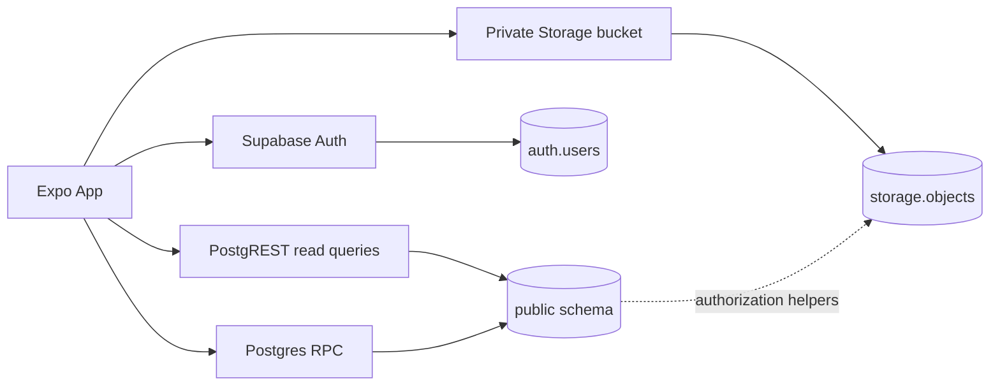
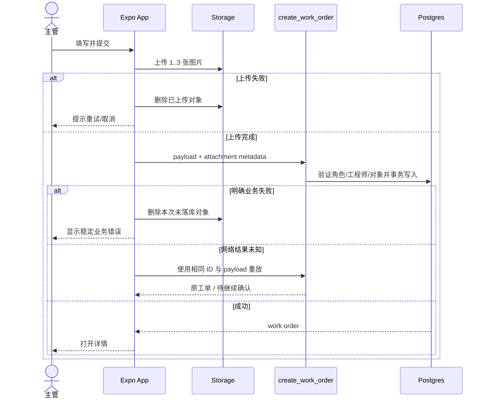
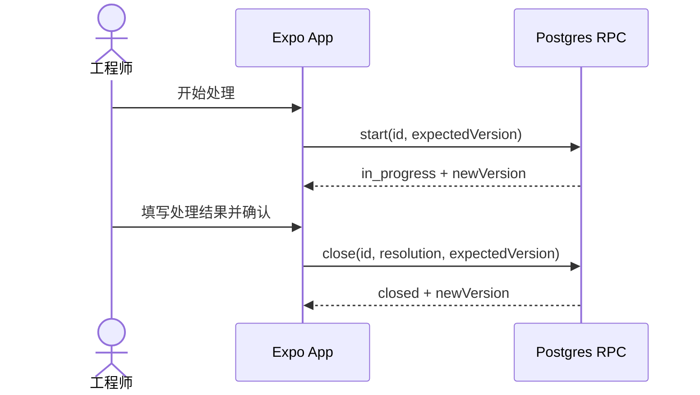

# 后端与数据库技术设计

版本：0.4

日期：2026-07-27

状态：P0/P1 后端与生成类型已实现；migration、pgTAP 与低权限集成已通过 CI

后端：Supabase Auth + Postgres + Storage

页面、Service 与本文后端能力的请求/响应映射以
[前后端对接契约](API_CONTRACT.md) 为唯一事实源。

## 1. 背景与目标

后端为真实邮箱密码登录、角色权限、工单状态机和现场照片提供服务端可信边界。V1 直接使用 Supabase，不创建自建 Node.js API。

非目标：开放注册、多项目、消息队列、推送、报表、完整审计事件流和离线冲突合并。

## 2. 架构与依赖



- 认证使用 Supabase JWT。
- 普通查询通过 PostgREST + RLS。
- 所有业务写入通过 Postgres RPC，避免客户端绕过角色、状态和列级规则。
- 图片放在私有 `work-order-media` bucket，读取权限与工单可见性一致。

## 3. 枚举

| 类型 | 值 |
| --- | --- |
| `app_role` | `elevator_supervisor`, `elevator_engineer` |
| `work_order_status` | `assigned`, `in_progress`, `closed` |
| `work_order_priority` | `normal`, `urgent` |

枚举只能通过 migration 变更；应用不得接受未知值或静默回退。

## 4. 表结构

### 4.1 `profiles`

| 字段 | 类型 | 可空 | 默认/约束 | 说明 |
| --- | --- | --- | --- | --- |
| `id` | `uuid` | 否 | PK；FK → `auth.users.id`；`ON DELETE CASCADE` | 与 Auth 用户一一对应 |
| `display_name` | `text` | 否 | `trim` 后长度 1–80 | 展示名 |
| `role` | `app_role` | 否 | 无客户端默认值 | 主管或工程师 |
| `is_active` | `boolean` | 否 | `true` | 停用后拒绝业务操作 |
| `created_at` | `timestamptz` | 否 | `now()` | 创建时间 |
| `updated_at` | `timestamptz` | 否 | `now()` | 更新时间 |

索引：

- `profiles(role, is_active)`：主管选择可用工程师。

### 4.2 `work_orders`

| 字段 | 类型 | 可空 | 默认/约束 | 说明 |
| --- | --- | --- | --- | --- |
| `id` | `uuid` | 否 | PK | 客户端创建草稿时预生成 |
| `elevator_area` | `text` | 否 | `trim` 后长度 1–80 | 电梯区域 |
| `elevator_code` | `text` | 否 | `trim` 后长度 1–80 | 梯号/设备编号 |
| `description` | `text` | 否 | `trim` 后长度 1–1000 | 故障描述 |
| `priority` | `work_order_priority` | 否 | `normal` | 一般/紧急 |
| `status` | `work_order_status` | 否 | `assigned` | 当前状态 |
| `created_by` | `uuid` | 否 | `work_orders_created_by_fkey` → `profiles.id`; `ON DELETE RESTRICT` | 创建主管 |
| `assignee_id` | `uuid` | 否 | `work_orders_assignee_id_fkey` → `profiles.id`; `ON DELETE RESTRICT` | 当前工程师 |
| `resolution` | `text` | 是 | 非空时 trim 长度 1–2000 | 处理结果 |
| `version` | `integer` | 否 | `1`; `>= 1` | 乐观锁 |
| `created_at` | `timestamptz` | 否 | `now()` | 创建时间 |
| `started_at` | `timestamptz` | 是 | 状态进入处理中时写入 | 开始处理时间 |
| `closed_at` | `timestamptz` | 是 | 状态关闭时写入 | 关闭时间 |
| `updated_at` | `timestamptz` | 否 | `now()` | 最近更新时间 |

一致性约束：

```text
assigned    => started_at IS NULL AND closed_at IS NULL AND resolution IS NULL
in_progress => started_at IS NOT NULL AND closed_at IS NULL AND resolution IS NULL
closed      => started_at IS NOT NULL AND closed_at IS NOT NULL
               AND length(trim(resolution)) > 0
```

索引：

- `work_orders(priority DESC, created_at DESC, id DESC)`：主管未筛选列表。
- `work_orders(status, priority DESC, created_at DESC, id DESC)`：主管列表。
- `work_orders(assignee_id, status, priority DESC, created_at DESC, id DESC)`：工程师列表。
- `work_orders(created_by, created_at DESC)`：创建记录定位。

### 4.3 `work_order_attachments`

| 字段 | 类型 | 可空 | 默认/约束 | 说明 |
| --- | --- | --- | --- | --- |
| `id` | `uuid` | 否 | PK | 附件 ID |
| `work_order_id` | `uuid` | 否 | `work_order_attachments_work_order_id_fkey` → `work_orders.id`; `ON DELETE RESTRICT` | 所属工单 |
| `storage_path` | `text` | 否 | UNIQUE | 私有 bucket 对象路径 |
| `mime_type` | `text` | 否 | `image/jpeg` | 前端归一化后的图片类型 |
| `size_bytes` | `integer` | 否 | `1..10485760` | 单图最大 10 MiB |
| `position` | `smallint` | 否 | `0..2`；同工单唯一 | 展示顺序 |
| `created_at` | `timestamptz` | 否 | `now()` | 创建时间 |

索引/约束：

- UNIQUE `(work_order_id, position)`。
- `work_order_attachments(work_order_id)`。
- 每单 1–3 张由 `create_work_order` RPC 在事务内验证。

## 5. 数据关系

```mermaid
erDiagram
    AUTH_USERS ||--|| PROFILES : "has"
    PROFILES ||--o{ WORK_ORDERS : "creates"
    PROFILES ||--o{ WORK_ORDERS : "is assigned"
    WORK_ORDERS ||--|{ WORK_ORDER_ATTACHMENTS : "contains 1..3"

    AUTH_USERS {
      uuid id PK
      text email
    }
    PROFILES {
      uuid id PK_FK
      text display_name
      app_role role
      boolean is_active
      timestamptz created_at
      timestamptz updated_at
    }
    WORK_ORDERS {
      uuid id PK
      text elevator_area
      text elevator_code
      text description
      work_order_priority priority
      work_order_status status
      uuid created_by FK
      uuid assignee_id FK
      text resolution
      integer version
      timestamptz created_at
      timestamptz started_at
      timestamptz closed_at
      timestamptz updated_at
    }
    WORK_ORDER_ATTACHMENTS {
      uuid id PK
      uuid work_order_id FK
      text storage_path UK
      text mime_type
      integer size_bytes
      smallint position
      timestamptz created_at
    }
```

不创建 `projects`、`elevators` 或 `audit_events` 表：V1 只有单项目、区域/梯号为自由文本，状态时间戳已覆盖当前验收需要。

## 6. 认证与账号

1. 管理员在 Supabase Dashboard 创建 Auth 用户。
2. 管理员在 `profiles` 写入展示名、角色和启用状态。
3. App 使用 `signInWithPassword`。
4. 登录后必须读取 `profiles`；不存在或 `is_active = false` 时立即退出并提示联系管理员。
5. 忘记密码使用 `resetPasswordForEmail`，redirect URL 为：

```text
elevatorhandoff://reset-password
```

Supabase Auth Redirect URLs 必须允许该 scheme。App 收到 recovery session 后要求输入并确认新密码，再调用 `auth.updateUser({ password })`。
Supabase Auth 的最小密码长度配置为 8，与客户端校验一致。

React Native 设置 `detectSessionInUrl = false`，因此 App 必须按
[API_CONTRACT.md 的 `AUTH-05`](API_CONTRACT.md#auth-05-消费密码重置深链)
解析 recovery deep link 并调用 `auth.exchangeCodeForSession(code)`，不能依赖浏览器自动处理
URL。Auth client 使用 PKCE，因此链接必须在发起重置的同一设备打开。
密码更新成功后只退出当前设备 session，再要求使用新密码登录。

不使用 `service_role` key，不在客户端调用 Admin API。

本地/CI 的 `supabase/config.toml` 必须关闭 Auth 自助注册，并将
`elevatorhandoff://reset-password` 加入允许的 redirect URL。托管测试项目必须在
Dashboard 使用相同设置；Admin API 预创建账号不受关闭自助注册影响。

## 7. RPC 契约

RPC 的 TypeScript 输入、统一返回类型、业务错误和前端调用顺序见
[API_CONTRACT.md 第 8 节](API_CONTRACT.md#8-rpc-接口)。本节定义数据库必须执行的校验。

### 7.1 `list_active_engineers()`

- 权限：启用的 `elevator_supervisor`。
- 输入：无。
- 输出：`id`, `display_name`。
- 排序：`display_name ASC, id ASC`。
- 只返回 `role = elevator_engineer AND is_active = true`。

### 7.2 `create_work_order(...)`

输入：

| 参数 | 类型 | 约束 |
| --- | --- | --- |
| `p_id` | `uuid` | 客户端预生成，重试保持不变 |
| `p_elevator_area` | `text` | 1–80 |
| `p_elevator_code` | `text` | 1–80 |
| `p_description` | `text` | 1–1000 |
| `p_priority` | `work_order_priority` | 必填 |
| `p_assignee_id` | `uuid` | 启用工程师 |
| `p_attachments` | `jsonb` | 1–3 项；只含 id/path/position |

规则：

- 调用者必须是启用主管。
- `p_assignee_id` 必须是启用工程师。
- 每个对象必须已存在于私有 bucket，`owner_id = auth.uid()`，路径必须为
  `work-orders/{auth.uid()}/{p_id}/{attachment_id}.jpg`。
- RPC 从 `storage.objects.metadata` 读取 MIME 和大小，验证 bucket 限制后写入附件表；
  不信任客户端声明的 MIME 或字节数。
- 同一 `p_id` 重试时，如果现有记录由同一主管创建且 payload 等价，返回现有记录；否则返回 `IDEMPOTENCY_CONFLICT`。
- 工单与附件行在一个数据库事务中创建。
- 返回统一 `WorkOrderMutationResult` 所需字段；Service 再读取完整详情。

### 7.3 `reassign_work_order(p_id, p_assignee_id, p_expected_version)`

- 权限：启用主管。
- 当前状态必须是 `assigned`。
- 新接手人必须是启用工程师且不同于当前接手人。
- `version` 必须等于 `p_expected_version`。
- 成功后更新 `assignee_id`、`updated_at`，并将 `version + 1`。
- 新工程师与当前工程师相同时返回 `ENGINEER_UNCHANGED`。
- 返回统一 `WorkOrderMutationResult` 所需字段。

### 7.4 `start_work_order(p_id, p_expected_version)`

- 权限：当前接手且启用的工程师。
- 当前状态必须是 `assigned`。
- 成功后写入 `status = in_progress`、`started_at = now()`、`updated_at`、`version + 1`。
- 返回统一 `WorkOrderMutationResult` 所需字段。

### 7.5 `close_work_order(p_id, p_resolution, p_expected_version)`

- 权限：当前接手且启用的工程师。
- 当前状态必须是 `in_progress`。
- `trim(p_resolution)` 长度 1–2000。
- 成功后写入 `status = closed`、处理结果、`closed_at = now()`、`updated_at`、`version + 1`。
- 返回统一 `WorkOrderMutationResult` 所需字段。

## 8. 错误契约

完整 `AppErrorCode` 与重试语义见
[API_CONTRACT.md 第 5 节](API_CONTRACT.md#5-统一错误类型)。RPC 业务异常统一使用
SQLSTATE `P0001`，并把下表 code 放在 `message`；客户端不展示 SQL、constraint 或内部堆栈。

| Code | 语义 | 客户端处理 |
| --- | --- | --- |
| `AUTH_REQUIRED` | 未登录/session 失效 | 清理 session，回登录页 |
| `ACCOUNT_DISABLED` | profile 被停用 | 退出并联系管理员 |
| `PROFILE_MISSING` | Auth 用户没有业务 profile | 退出并联系管理员 |
| `ROLE_FORBIDDEN` | 角色不允许 | 提示无权限，返回列表 |
| `NOT_FOUND_OR_FORBIDDEN` | 工单不存在或调用者不可见 | 使用统一不可用页面 |
| `VALIDATION_FAILED` | 字段不合法 | 定位到对应字段 |
| `ENGINEER_INACTIVE` | 工程师无效或停用 | 刷新工程师列表 |
| `ENGINEER_UNCHANGED` | 新旧工程师相同 | 保持详情，不提交 |
| `PHOTO_COUNT_INVALID` | 附件不是 1–3 张 | 返回图片区域 |
| `PHOTO_TYPE_INVALID` | Storage MIME 不允许 | 移除对应照片 |
| `PHOTO_SIZE_INVALID` | Storage 对象超过 10 MiB | 压缩或重新选择 |
| `PHOTO_OBJECT_MISSING` | Storage 对象不存在 | 重传失败照片 |
| `INVALID_TRANSITION` | 状态流转非法 | 刷新详情 |
| `RESOLUTION_REQUIRED` | 处理结果为空 | 聚焦处理结果 |
| `VERSION_CONFLICT` | 乐观锁冲突 | 提示并刷新 |
| `IDEMPOTENCY_CONFLICT` | 相同 ID 对应不同 payload | 生成新草稿 ID 后重试 |

PostgREST、Auth 和 Storage 原始错误只在 Service 层映射，不伪装成 RPC business code。
网络层只对安全的读取自动重试一次；业务写入由用户明确重试，并遵循对接契约的
ID/version 规则。

## 9. RLS 权限矩阵

所有业务表启用 RLS，默认拒绝。客户端角色无 `INSERT/UPDATE/DELETE` 直写策略，写入只通过限定 RPC。
除读取自己的 profile 用于停用检测外，所有读取和 RPC 都要求调用者 profile
`is_active = true`。

| 资源/动作 | 主管 | 当前工程师 | 其他工程师 | 匿名 |
| --- | --- | --- | --- | --- |
| 读取自己的 profile | 允许 | 允许 | 允许 | 拒绝 |
| 读取人员摘要 | 全部 | 自己 + 自己工单的创建主管 | 拒绝 | 拒绝 |
| 列出启用工程师 | RPC 允许 | 拒绝 | 拒绝 | 拒绝 |
| 读取全部工单 | 允许 | 仅自己的 | 仅自己的 | 拒绝 |
| 读取工单附件行 | 全部可见工单 | 仅自己工单 | 仅自己工单 | 拒绝 |
| 创建工单 | RPC 允许 | 拒绝 | 拒绝 | 拒绝 |
| 改派 `assigned` | RPC 允许 | 拒绝 | 拒绝 | 拒绝 |
| 开始/关闭工单 | 拒绝 | RPC 允许 | 拒绝 | 拒绝 |
| 删除工单/附件行 | 拒绝 | 拒绝 | 拒绝 | 拒绝 |

`profiles` SELECT policy 只支持当前 profile 和工单关联所需的最小摘要：

- `id = auth.uid()` 始终允许，使停用账号能读取自身状态并正确退出；
- 启用主管可读所有 profile 摘要，以显示历史工单接手人；
- 启用工程师只可读自己，以及 `assignee_id = auth.uid()` 工单的 `created_by` profile；
- 工程师不能读取其他工程师摘要，主管工程师选择仍只通过
  `list_active_engineers()` 返回启用账号。

以上规则由固定 `search_path` 的 `can_read_profile_summary(target_id)` helper 实现，避免
profile/work order policy 相互递归。附件 SELECT policy 复用工单可见性 helper。

权限 helper 必须是固定 `search_path` 的 `security definer` 函数，并撤销 `public` 和
`anon` 默认执行权限，只向 `authenticated` 授予需要的 RPC。

上表只描述客户端角色。运行时注入的 `service_role` 仅供本地/CI/E2E 的夹具准备与清理，
对 `profiles`、`work_orders`、`work_order_attachments` 显式授予
`SELECT/INSERT/UPDATE/DELETE`；不得把该密钥注入 App 或 EAS build。

## 10. Storage

Bucket：

```text
work-order-media (private)
```

对象路径：

```text
work-orders/{uploader_user_id}/{work_order_id}/{attachment_id}.jpg
```

规则：

- bucket 配置 `public = false`、`file_size_limit = 10 MiB`，allowed MIME 仅 `image/jpeg`。
- INSERT policy：仅启用主管；路径段必须匹配
  `work-orders/{auth.uid()}/{work_order_id}/{attachment_id}.jpg`。
- SELECT policy：
  - 已落库对象要求 `storage_path` 已存在于 `work_order_attachments`，且调用者可读取对应工单；
  - 尚未落库的草稿对象只允许启用主管读取本人上传且路径合法的对象，用于 Supabase
    Storage 上传的 `INSERT ... RETURNING` 响应。对象一旦落库，该草稿分支立即失效。
- DELETE policy：仅 `owner_id = auth.uid()` 的启用主管，且该 path 尚未进入附件表。
- 不创建 UPDATE policy，客户端上传固定 `upsert: false`。
- 客户端上传全部成功后调用创建 RPC；明确业务失败时删除本次未落库对象，网络结果未知时
  复用同一 ID 重放 RPC，不能先删除。
- RPC 从 `storage.objects` 只读验证对象元数据；所有上传和删除仍通过 Storage API。
- V1 只保证 App 可继续执行时的补偿清理。进程强制终止等异常中断由 Storage 控制台人工
  清理；需要自动保证时再增加调用 Storage API 的定时 Edge Function。

草稿 SELECT 是对原实现前契约的必要收窄修正：当前 Storage API 的上传响应需要读取刚插入
的对象；若 SELECT 仅允许已落库附件，RPC 前的上传会被 RLS 拒绝。此分支带
`NOT EXISTS work_order_attachments`，不会扩大已落库附件的读取权限。依据：
[Supabase Storage 403 troubleshooting](https://supabase.com/docs/guides/troubleshooting/storage-error-403-forbidden-new-row-violates-row-level-security-policy-on-upload-a94384)。

## 11. 关键时序

### 创建工单



### 工程师处理



## 12. 配置

| 变量 | 客户端可见 | 必填 | 说明 |
| --- | --- | --- | --- |
| `EXPO_PUBLIC_SUPABASE_URL` | 是 | 是 | Supabase Project URL |
| `EXPO_PUBLIC_SUPABASE_PUBLISHABLE_KEY` | 是 | 是 | 客户端 publishable key |

`service_role` 只允许在 Supabase 托管环境、控制台或本地/CI/E2E 数据准备进程中运行时注入；
项目源码、App 和 EAS build 环境不得保存。

## 13. 性能与容量

PoC 默认规模：最多 100 个账号、10,000 个工单、每单最多 3 图。

- 列表分页每页 20 条，按紧急优先、创建时间倒序。
- 列表不下载原图；详情按需获取私有图片。
- 查询目标：正常网络下数据库 p95 小于 500ms；图片上传不计入该指标。
- 当前规模不增加缓存、队列或读副本；达到真实测量瓶颈后再引入。

## 14. 观测与安全

- Supabase Auth/Postgres/Storage 日志用于 PoC 排障；禁止记录密码、token、图片二进制和完整处理结果。
- RPC 错误记录函数名、user id、work order id、business code，不记录敏感 payload。
- 所有外部文本在数据库边界 trim、长度校验。
- RLS 集成测试必须使用真实低权限 JWT，不只用 service role 验证。
- 紧急工单不触发自动救援；UI 与 PRD 均保留线下应急声明。

## 15. Migration 与类型同步

当前实现：

- `supabase/migrations/20260725000000_initial_backend.sql` 是从空库重放的单一 schema
  事实源，包含枚举、表、constraint、索引、RLS、RPC、私有 bucket 和 Storage policy。
- `supabase/tests/database/backend_test.sql` 在事务内创建虚构 Auth/profile/Storage 数据，
  覆盖 schema、拒绝路径、主状态流转、版本冲突和跨工程师隔离。
- 测试数据不写入 seed，避免仓库保存可登录凭据；本地 Auth 集成账号由后续集成测试通过
  本地 Admin API 临时创建。
- GitHub Verify 已从空库重放 migration，并通过 43 项 pgTAP 与真实低权限
  Auth/RLS/Storage/RPC 集成测试。
- `src/types/database.generated.ts` 已从实际 migration schema 生成并接入 Supabase Client，
  不允许手写：

```bash
supabase db reset
supabase test db
pnpm run types:generate
```

`database.generated.ts` 由命令生成，不手工修改。任何 schema migration 必须在同一变更中重新生成类型并更新本文档。
GitHub Verify 会在 migration 重放后再次生成该文件并与仓库版本比较；存在差异时直接失败，
避免数据库、Service 与提交类型静默漂移。

## 16. 测试与验收

完整环境、角色矩阵、CI 和验收映射以 [TESTING.md](TESTING.md) 为准。后端变更至少覆盖：

- pgTAP：schema、constraint、RPC、RLS、Storage policy。
- 真实低权限 JWT：主管、工程师 A、工程师 B、停用用户和匿名用户。
- Auth/Mailpit：错误密码、8 位最小密码、停用 profile、重置密码 redirect。
- 集成：部分上传清理、明确 RPC 失败清理、结果未知幂等重放、重复提交和版本冲突。

## 17. 风险与未决事项

- 当前没有设备台账，区域和梯号是自由文本；真实数据出现明显重复后再设计台账。
- V1 无自动孤儿文件清理；如果实际出现较多残留，再增加通过 Storage API 清理的定时
  Edge Function。
- 邮件重置送达率依赖 Supabase Auth 邮件配置；正式测试前需配置发件域名或确认默认邮件限制。

## 18. 变更记录

| 日期 | 修改人 | 摘要 |
| --- | --- | --- |
| 2026-07-27 | Codex | 同步 GitHub CI migration、43 项 pgTAP 与低权限集成验证结果。 |
| 2026-07-25 | Codex | 为 Storage 上传返回增加仅限本人未落库草稿的 SELECT 分支，落库后仍按工单权限读取。 |
| 2026-07-25 | Codex | 落地单一 migration、P0/P1 RPC/RLS/Storage policy 与最小 pgTAP；记录待运行验证项。 |
| 2026-07-25 | Codex | 建立 Supabase schema、关系、RPC、RLS 与 Storage 基线。 |
