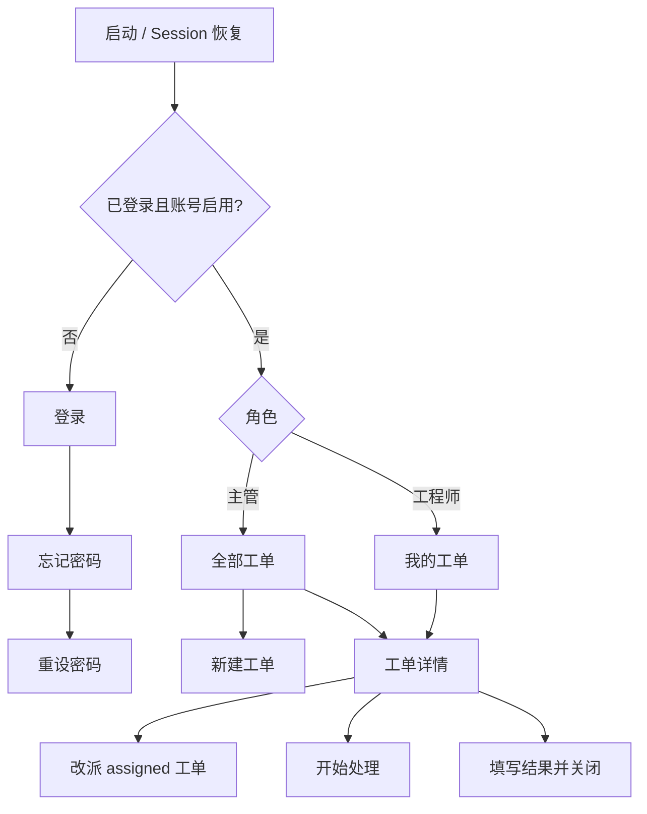
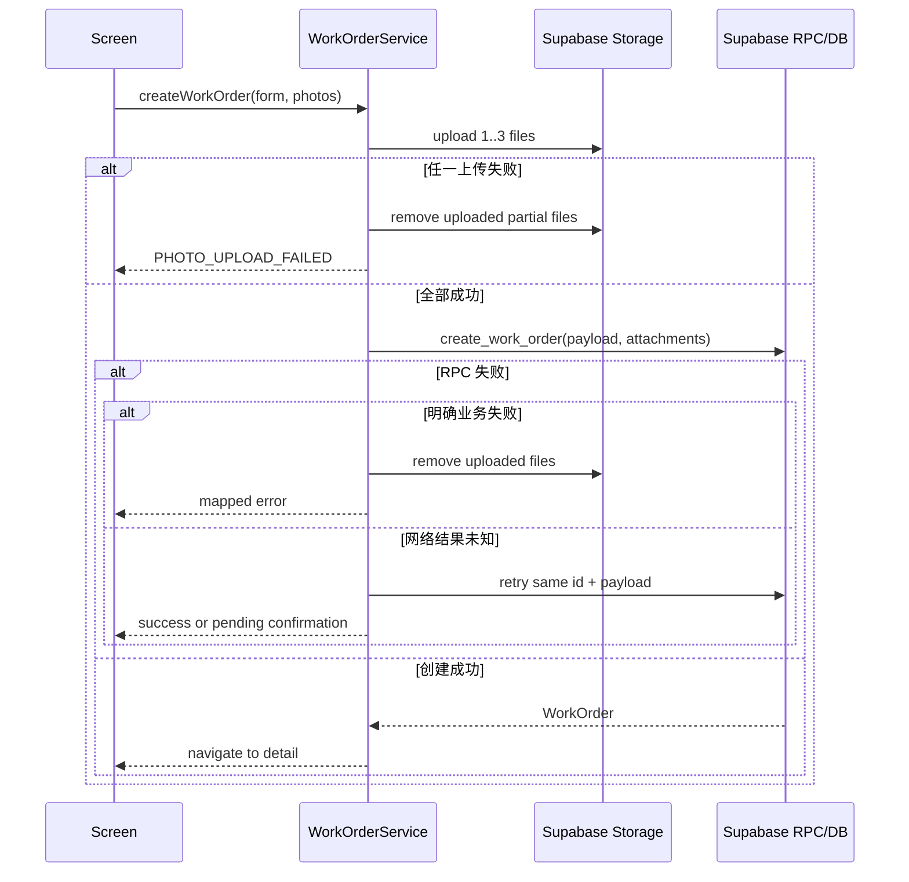

# 前端技术设计

版本：0.4

日期：2026-07-27

状态：P0/P1 已实现；iOS Simulator 的登录、失效重置与完整派工闭环 Maestro 已验证；Android 与真机 UAT 待执行

技术栈：Expo + React Native + TypeScript + Expo Router

页面到 Service、Supabase Auth、查询、RPC 和 Storage 的具体映射以
[前后端对接契约](API_CONTRACT.md) 为唯一事实源。

## 1. 背景与目标

前端为电梯区域主管和电梯工程师提供角色化移动流程。主管关注快速派工与全局状态，工程师关注“只看我的任务”和最短处理闭环。

非目标：自助注册、App 内人员管理、推送、离线写入、报表、评论和设备台账。

## 2. 可验收用例

- Given 已创建的主管账号，When 邮箱密码正确，Then 进入主管工单列表。
- Given 主管填写完整且 1–3 张图片上传成功，When 提交，Then 创建 `assigned` 工单且按钮不可重复触发。
- Given 工程师是当前接手人，When 点击“开始处理”，Then 工单进入 `in_progress`。
- Given 工程师填写非空处理结果，When 点击“完成并关闭”，Then 工单进入 `closed` 且页面只读。
- Given 非接手工程师访问工单，When 服务端返回无权限，Then 显示无权限页并返回列表。

## 3. 信息架构



建议路由：

```text
app/
├── _layout.tsx
├── (auth)/
│   ├── login.tsx
│   ├── forgot-password.tsx
│   └── reset-password.tsx
└── (app)/
    ├── _layout.tsx
    ├── index.tsx
    ├── work-orders/new.tsx
    ├── work-orders/[id].tsx
    └── profile.tsx
```

角色决定首页数据和可见操作，不复制两套详情页面。

### iOS 原生导航兼容

iOS 26.5 Simulator 的 Fabric 原生 Screen Stack 会在进入新建工单时，于卸载旧页的
`setViewToSnapshot` 阶段异常退出；项目保留精确的 iOS 26 guard
[`patches/react-native-screens@4.26.2.patch`](../patches/react-native-screens@4.26.2.patch)。Cloud iOS 18.2
旧 binary 也在进入新建页退出；该页曾同步调用未显式提供的全局 `crypto`。本地草稿 ID 现在由不依赖
Hermes 全局或额外原生模块的 RFC 4122 v4 兼容生成器创建。2026-07-29 的
`critical-journey.yml` 已在 iOS 26.5 Simulator 通过完整业务闭环；此证据不替代未来重新生成原生
artifact 后的复验，依赖升级也不能只用登录 smoke 验收。

## 4. 页面与状态

| 页面 | Loading | Empty | Error / Recovery | 主操作 |
| --- | --- | --- | --- | --- |
| 启动 | 全屏进度 | N/A | Session 读取失败：重试或退出 | N/A |
| 登录 | 按钮内 loading | N/A | 字段下错误；认证失败可重试 | 登录 |
| 忘记密码 | 按钮内 loading | N/A | 限流/网络错误可重试；不暴露邮箱是否存在 | 发送重置邮件 |
| 重设密码 | 验证链接 loading | N/A | 无效、失效或 10 秒内未完成的 recovery exchange 均显示“链接无法使用”，可重新发送 | 保存新密码 |
| 工单列表 | 骨架卡片 | 提示当前无工单；主管可新建 | 顶部错误条 + 下拉重试 | 主管：新建工单 |
| 新建工单 | 上传/提交进度 | N/A | 定位到首个错误；照片或补偿失败可重试；退出前再次清理草稿 | 创建并派工 |
| 工单详情 | 详情骨架 | 工单不存在 | 无权限/版本冲突后重新加载 | 由角色和状态决定 |
| 重设密码 | 解析 deep link / 按钮 loading | N/A | 链接失效时重新发送 | 保存新密码 |

新建工单的本地草稿 ID 必须在 Hermes 没有全局 `crypto` 时也能生成 RFC 4122 v4 格式值；不得在导航完成前
同步依赖未链接的原生模块。该 ID 只用于幂等创建关联，授权、字段校验和最终持久化仍由 Supabase RPC 完成。

表单滚动必须在 iOS 上收起软键盘，避免键盘遮挡下方的工程师选择和提交控件；自动化 Flow 也必须在描述输入后
显式完成键盘收起，再继续点击动态列表。

优先级和工程师单选卡片保留 `radio` 语义；触摸与 iOS 辅助功能激活必须调用同一状态更新，保证 VoiceOver 与
Maestro 的无障碍激活不会出现“点击成功但选择未变化”。
| 个人中心 | profile loading | N/A | profile 无效时退出登录 | 退出当前设备 |

页面重新聚焦和下拉刷新时重新查询。V1 不做 realtime subscription；界面必须显示“上次更新”时间，避免用户误以为是实时数据。

密码重置路由同时处理冷启动初始 URL 和运行中 URL event；同一 recovery URL 只消费一次。Expo Router
可能先消费冷启动 URL，因此重设密码页还必须以路由参数为兜底触发 recovery 校验，不能只依赖根布局的
`Linking.getInitialURL()`。

## 5. 客户端类型

Service 向 UI 暴露的 `AuthContext`、`Profile`、`WorkOrderPage`、
`WorkOrderDetail`、输入类型和 `AppError` 见
[API_CONTRACT.md 第 4–5 节](API_CONTRACT.md#4-前端公共类型)。

实现时由 Supabase schema 生成 `database.generated.ts`；Service 负责把数据库 snake_case
字段映射为契约中的 camelCase 业务类型。UI 不导入数据库 Row 类型，也不手写第二套后端字段。

## 6. 客户端数据流



全局只保存 session、profile 与恢复状态。列表、详情和表单使用页面级 state；V1 不引入 Redux。

## 7. Service 契约

```ts
interface AuthService {
  restoreSession(): Promise<AuthContext | null>;
  subscribe(listener: AuthStateListener): () => void;
  signIn(input: SignInInput): Promise<AuthContext>;
  requestPasswordReset(email: string): Promise<void>;
  consumePasswordRecoveryUrl(url: string): Promise<void>;
  completePasswordReset(password: string): Promise<void>;
  signOut(): Promise<void>;
}

interface ProfileService {
  getCurrent(): Promise<Profile>;
  listActiveEngineers(): Promise<EngineerOption[]>;
}

interface WorkOrderService {
  list(input: ListWorkOrdersInput): Promise<WorkOrderPage>;
  getById(id: string): Promise<WorkOrderDetail>;
  create(input: CreateWorkOrderInput): Promise<WorkOrderDetail>;
  cancelDraft(id: string): Promise<void>;
  reassign(input: ReassignWorkOrderInput): Promise<WorkOrderMutationResult>;
  start(input: StartWorkOrderInput): Promise<WorkOrderMutationResult>;
  close(input: CloseWorkOrderInput): Promise<WorkOrderMutationResult>;
}
```

每个方法对应的具体 Auth / Query / RPC / Storage 接口、参数、返回和错误见
[API_CONTRACT.md 第 3 节](API_CONTRACT.md#3-功能到后端接口总表)。页面只依赖这些
Service，不依赖 Supabase client。

## 8. 表单和交互

- 每个输入都有可见 label；placeholder 只提供示例。
- 邮箱使用 email keyboard 和系统 autofill；密码提供显示/隐藏。
- 图片最多 3 张，每张选择后立即显示缩略图、上传状态和移除按钮。
- 表单在 blur 或提交时校验；不在每次按键时打断用户。
- 提交期间按钮显示进度且 disabled。
- 版本冲突提示“工单已被其他人更新”，重新加载详情，不静默覆盖。
- 创建 RPC 结果未知时保留原草稿 ID 和图片路径，重放同一幂等请求；不能先删除图片或生成
  新 ID。
- 新建页退出前调用 `cancelDraft`；没有已上传对象时立即返回。清理失败时保留草稿并留在
  当前页，允许用户再次重试；提交期间禁用返回。
- 关闭是不可逆动作，提交前显示确认 sheet；处理结果为空时不打开确认。
- 图片加载失败只影响对应缩略图；用户可单图重试，不让整页进入 error。
- 忘记密码提交后使用统一成功提示，不暴露邮箱是否存在。
- 退出登录只退出当前设备，并清理内存数据和临时图片 URL。

## 9. 组件边界

```text
AppShell
├── ScreenHeader
├── WorkOrderList
│   └── WorkOrderCard
├── WorkOrderForm
│   ├── LabeledField
│   ├── PrioritySegment
│   ├── EngineerPicker
│   └── PhotoPicker
├── WorkOrderDetail
│   ├── StatusBadge
│   ├── PhotoStrip
│   └── StatusAction
└── Feedback
    ├── InlineError
    ├── EmptyState
    └── LoadingState
```

只在两个以上页面确实复用时提取组件；不建立通用表单框架。

## 10. UI 与无障碍

- 遵循 `design-system/电梯故障派工/MASTER.md`。
- 工业工具风，浅色高对比；不用紫色渐变、玻璃卡片、漂浮装饰或 AI 助手文案。
- 所有触控区域至少 44×44pt；主按钮高度建议 48pt。
- 状态使用“文字 + 颜色/图形”，不能只靠红绿区分。
- 交互组件提供 `accessibilityLabel`、role/state；错误信息可被 screen reader 宣读。
- 支持 Dynamic Type；文本优先换行，不用固定高度裁切。
- 尊重 reduced motion；仅使用 150–200ms 的原生反馈动画。
- Safe Area 覆盖刘海、Dynamic Island 和底部手势区域。

## 11. 性能与资源

- 列表使用 `FlatList`，提供稳定 key；超过 50 条仍不渲染全部卡片。
- 现场图上传前统一转换为最长边 2048px、质量 0.82 的 JPEG，并检查不超过 10 MiB；
  列表不加载图片，详情按需加载。
- 页面 loading 超过 300ms 显示骨架；网络失败提供明确重试。
- 不预加载全部工单照片，不引入未使用的动画或状态管理库。

## 12. 文案

| Key | 默认中文 |
| --- | --- |
| `auth.login` | 登录 |
| `auth.forgotPassword` | 忘记密码 |
| `workOrder.assigned` | 待处理 |
| `workOrder.inProgress` | 处理中 |
| `workOrder.closed` | 已关闭 |
| `workOrder.urgent` | 紧急 |
| `workOrder.create` | 创建并派工 |
| `workOrder.start` | 开始处理 |
| `workOrder.close` | 完成并关闭 |
| `error.versionConflict` | 工单已被其他人更新，请刷新后重试 |

V1 只交付中文；key 保留以便后续国际化，不在首版引入翻译依赖。

## 13. 测试与验收

完整层级、命令、E2E 和验收证据以 [TESTING.md](TESTING.md) 为准。前端变更至少覆盖：

- TypeScript：导航参数、service 输入输出和状态枚举无 `any`。
- Jest/RNTL：表单校验、错误映射、角色操作、loading/error/retry。
- Expo Router：登录守卫、角色路由和密码重置深链。
- Maestro：主管建单/改派、工程师开始/关闭、照片选择与校验错误；动态工程师卡片同时保留
  可访问名称和 `engineer-option-<displayName>` testID，避免 iOS 系统 UI 自动化只命中文本。
- iOS 26：先验证“登录 → 新建工单”不会使 App 退出，再执行完整关键流；原生退出不能通过重试
  标记为通过。
- 无障碍/真机：VoiceOver/TalkBack、44pt 触控、最大字体、错误宣读。

## 14. 风险与假设

- EAS iOS 真机需要付费 Apple Developer；没有账号时使用本地 Xcode 路径。
- V1 非实时；通过刷新与“上次更新”降低认知偏差。
- 自由文本区域/梯号可能产生脏数据；有真实设备台账后再升级为受控选择。

## 15. 变更记录

| 日期 | 修改人 | 摘要 |
| --- | --- | --- |
| 2026-07-29 | Codex | 三次 iOS 26.5 Simulator 构建证明：快照 guard 只能推进崩溃点，随后仍在 Screen Stack 回收、转场事件和 UIKit 卸载时退出。撤回未验证的私有补丁，iOS 26 明确阻塞至上游兼容版本。 |
| 2026-07-29 | Codex | 根因确认在 `react-native-screens` Fabric 快照路径；以 pnpm patch 在精确固定的 4.26.2 上跳过 iOS 26 快照，待新 iOS 构建与完整 Maestro 复验。 |
| 2026-07-28 | Codex | iOS Maestro 登录与失效重置通过；关键流在 iOS 26 Fabric Screen Stack 旧页快照处崩溃，未将其误标为通过。 |
| 2026-07-28 | Codex | 三组公开内部演示账号已通过 Auth/profile smoke；原生页面登录和主流程仍需独立验收。 |
| 2026-07-28 | Codex | 审校 P2 证据：iOS Simulator 已冷启动到真实登录页；真实账号登录、Maestro 与双端 UAT 未完成。 |
| 2026-07-27 | Codex | 补齐新建页退出前的草稿照片补偿与重试契约。 |
| 2026-07-25 | Codex | 建立 Expo 前端实现基线与验收契约。 |
| 2026-07-25 | Codex | 补齐页面到 Service 和 Supabase 接口的一对一映射。 |
| 2026-07-25 | Codex | 开始按 P0→P1 落地真实认证、角色路由、三个 Service 与工单闭环；页面仅调用 Service。 |
| 2026-07-25 | Codex | 完成真实认证/重置深链、角色守卫、工单列表/建单/详情/改派/开始/关闭和最小前端测试；集成与真机证据仍待执行。 |
| 2026-07-25 | Codex | 为 P2 主流程补齐稳定 testID/可访问名称；EAS Maestro 与真机无障碍结果尚未验证。 |
