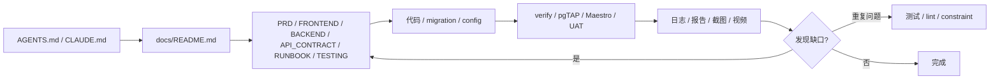
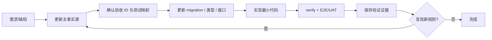

# Harness Engineering 开发护栏

版本：0.6

日期：2026-07-30

## 目标

让后续开发者或 coding agent 能从仓库直接获得产品、架构和验证上下文，并通过固定变更顺序与机械检查避免“代码已经变了、文档仍停在旧版本”。

本方案采用 OpenAI [Harness engineering](https://openai.com/index/harness-engineering/) 的核心原则，并按当前 PoC 规模收敛：

1. 仓库内版本化知识是事实源。
2. `AGENTS.md` 只做通用地图，Codex 直接读取，Claude Code 通过
   `CLAUDE.md` 导入。
3. 文档、UI、日志、测试和构建结果必须对 agent 可读取。
4. 只强制架构边界和产品不变量，不规定无关实现细节。
5. 重要约束通过类型、constraint、RLS、lint 和结构测试机械执行。
6. 失败和 review 反馈要回写为文档、测试或 lint 规则。
7. 定期清理漂移和坏模式，避免 agent 复制已有缺陷。

不直接照搬大型仓库的全部目录、后台 agent 或宽松合并策略。当前涉及真实认证和 RLS，安全与主流程测试必须阻塞；只有出现真实需求时才增加执行计划目录和自动清理任务。

## 知识与反馈闭环

聊天或口头结论只有写回事实源后才算项目决策。CI/EAS 证据必须能由后续 agent 找到或由人提供链接。

## 事实源与责任

| 事实 | 唯一主文档 | 代码侧验证 |
| --- | --- | --- |
| 文档目录、状态、证据 | `docs/README.md` | 链接与状态检查 |
| 产品范围、角色、验收 | `docs/prd.md` | E2E/验收场景 |
| 层级和依赖方向 | `ARCHITECTURE.md` | import lint / typecheck |
| 页面、交互、客户端契约 | `docs/FRONTEND.md` | TypeScript、组件/流程测试 |
| 表、RPC、RLS、Storage | `docs/BACKEND.md` | migration、生成类型、RLS 测试 |
| 页面、Service、请求响应和错误映射 | `docs/API_CONTRACT.md` | 生成类型、集成测试、E2E |
| 视觉和可访问性 | `design-system/电梯故障派工/MASTER.md` | UI review、a11y 检查 |
| 构建和设备安装 | `docs/RUNBOOK.md` | `expo-doctor`、EAS build |
| 测试、CI、E2E、验收证据 | `docs/TESTING.md` | `verify`、pgTAP、Maestro、UAT |

同一个事实只能有一个主文档；其他文件通过链接引用，不复制一套可能漂移的定义。

`CLAUDE.md` 是兼容入口，不是第二份事实源。修改 agent 规则时只改
`AGENTS.md`，并验证 `CLAUDE.md` 仍包含 `@AGENTS.md`。

## 变更级联

| 变更类型 | 必须同批更新 |
| --- | --- |
| 产品行为/角色 | PRD → FRONTEND/BACKEND → 测试 |
| 表、字段、枚举、RLS | BACKEND → migration → generated types → service → 测试 |
| 页面/交互/文案 | FRONTEND → UI → 测试；视觉规则变化再改 MASTER |
| Service、请求响应或错误 | API_CONTRACT → BACKEND/FRONTEND → generated types → 集成测试 |
| 原生依赖、权限、EAS | RUNBOOK → app config/eas.json → 双端构建验证 |
| 测试工具、命令、CI/E2E | TESTING → package/workflow → 验证证据 |
| Review 中重复出现的问题 | 对应主文档 + 一个可执行测试/lint |

## Agent 工作协议

每个开发任务：

1. 从工具自动入口加载 `AGENTS.md`，按任务路由找到相关主文档。
2. 用 `rg` 找完整调用链和现有模式。
3. 在写代码前更新主文档；不创建第二套契约。
4. 实现最小变更，优先平台能力与现有依赖。
5. 为行为变化增加测试；修复缺陷时先留下能复现问题的回归测试。
6. 运行 `pnpm run verify` 和 `docs/TESTING.md` 要求的 E2E/UAT。
7. 保存失败与成功证据，让后续 agent 能定位执行命令和结果。
8. 对照 PRD 检查角色、状态、失败恢复与安全边界。
9. 如果代码无法满足文档，停止并修正文档/决策，不静默偏离。
10. 交付前按 `AGENTS.md` 的非门禁记录规范更新 AI 对话 JSONL。

## 机械护栏

首个 Expo scaffold 必须实现 `docs/TESTING.md` 定义的命令契约。护栏分两层：

| 不变量 | 机械执行 |
| --- | --- |
| TypeScript 和依赖方向 | typecheck、lint、结构测试 |
| Expo 配置与原生依赖 | `expo-doctor`、EAS build |
| Schema 可重建 | `supabase db reset` |
| constraint、RPC、RLS、Storage | pgTAP + 低权限集成测试 |
| PRD 主流程 | Maestro Android/iOS |
| 文档和工具入口 | Markdown/链接、`@AGENTS.md` |
| 无凭据入库 | secret scan + review |

`.github/workflows/verify.yml` 在 GitHub runner 启动隔离的本地 Supabase，并按完整
`pnpm run verify` 命令链执行具名 steps；它不接触托管项目或 E2E 管理密钥。

规则优先写成标准工具能执行的检查。只有现有工具无法表达时才新增自定义脚本；脚本失败信息必须说明修复方式。

## Agent 可读性

- UI 关键控件提供稳定可访问名称和 `testID`，便于 RNTL/Maestro 操作。
- 网络/RPC 错误保留稳定业务 code，不要求 agent 解析随机文案。
- 测试失败保存测试名、账号角色、工单 ID、预期/实际状态。
- E2E 保存日志、截图和视频；不依赖人工口述复现过程。
- 本地 Supabase 使用确定 seed，测试可从空库重建。
- 性能或可靠性目标只有在能采集相应指标时才作为门禁。

## 执行计划与决策

复杂任务是否需要版本化执行计划，按 `docs/README.md` 的阈值判断。计划不是需求副本，必须引用 PRD 验收 ID，并记录：

- 当前进度和下一步；
- 关键决策及原因；
- migration/发布/回滚顺序；
- 验证命令和证据。

小任务继续使用任务内计划，避免为流程而创建文件。
复杂任务计划格式参考
[Using `PLANS.md` for multi-hour problem solving](https://developers.openai.com/cookbook/articles/codex_exec_plans)。

## 反馈与熵控制

- 第一次缺陷：修复根因并增加最小回归测试。
- 同类问题第二次出现：升级为共享测试、lint、constraint 或明确架构规则。
- PR review 发现文档误导：同一变更修正文档和索引状态。
- 每次发布候选检查陈旧文档、跳过测试、孤儿 TODO 和重复 helper。
- 暂不创建定时“文档园艺”自动任务；当仓库开始持续开发或每周出现漂移时再启用。

## Review 清单

- 变更是否修改了角色、状态、字段或权限，但没有更新主文档？
- UI 是否直接访问数据库或绕过 service？
- 客户端是否直接更新受保护业务字段，而不是调用 RPC？
- 是否新增了 PRD 未要求的依赖、表、状态或抽象？
- 错误路径是否允许恢复，异步提交是否防重复？
- PRD 验收 ID 是否更新了 `TESTING.md` 映射和自动测试？
- 权限测试是否使用真实低权限身份并覆盖拒绝路径？
- 测试失败是否留下 agent 可读证据，是否存在靠重试隐藏的 flake？
- 生成类型漂移是否在 GitHub annotations 中保留可定位的差异行？
- Android/iOS build profile 是否仍与 RUNBOOK 一致？
- 是否能用测试或 constraint 代替容易腐烂的文字提醒？

## 当前缺口

仓库已具备知识索引、验收 ID、P0/P1 业务源码、Supabase migration、pgTAP、前端单元测试、
文档门禁、GitHub `verify` workflow、低权限 Supabase 集成套件、Maestro flows 与双平台
EAS workflow。GitHub CI 已完成 migration 重放、43 项 pgTAP、低权限集成与本地
Mailpit/PKCE 密码重置验证；数据库生成类型及漂移门禁已落地。iOS 26.5 Simulator 已通过
Maestro 登录、失效重置与完整派工闭环；`react-native-screens` 的固定版本和 patch 必须保留，升级后须先复验三条 Flow，不能仅凭单页 smoke 宣称兼容。

当前未完成的是 Android Maestro、真机跨设备 UAT、真实邮件重置和真机证据。本地 Xcode Release 原生产物
已通过三条 iOS Flow；两台独立 iOS Simulator 也已完成主管建单、工程师关闭、主管新会话读取的跨会话
自动验证，但不等同于上述真机人工验证。本机 npm 启动的
Supabase CLI 仍存在 Node/Corepack 兼容问题；官方 macOS ARM64 CLI 可执行只读管理操作，且 GitHub
Ubuntu Verify 已完整通过 DB/低权限集成与 Mailpit/PKCE 门禁，见 `docs/TESTING.md` 第 12 节。该 CI
证据不替代 Android、真机跨设备 UAT、真实邮件和真机验收。

后续实现任务必须按 `docs/TESTING.md` 扩展对应自动链路；只有检查真实运行并产生证据后，
才能在 `docs/README.md` 提升状态。
