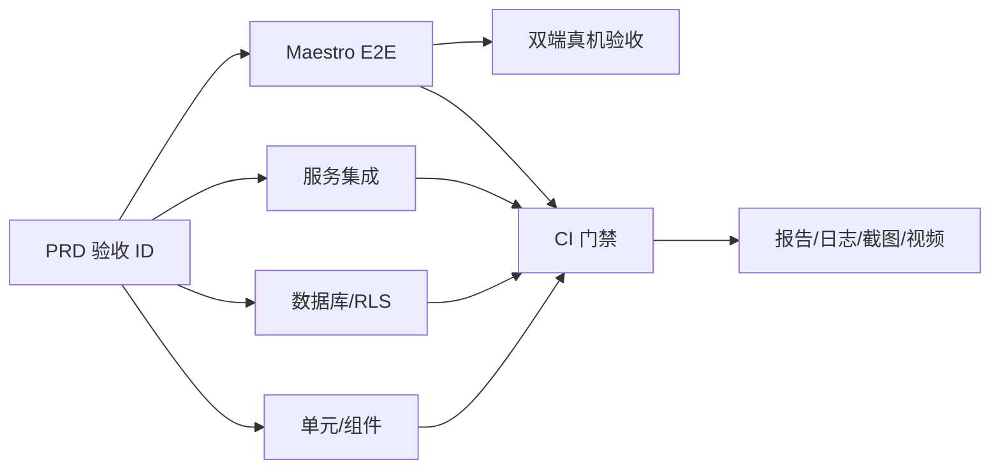

# 测试与质量策略

版本：0.6

最后审校：2026-07-27

## 1. 目标

建立从需求到交付证据的完整链路：



测试必须回答三件事：

1. 产品行为是否符合 PRD。
2. Supabase 权限是否在服务端真实生效。
3. Android/iOS 构建是否能由用户完成主流程。

## 2. 测试原则

- 测试用户可观察行为，不测试组件内部实现。
- 权限、状态机和数据完整性优先放在 Postgres constraint、RPC 和 RLS 测试。
- 页面测试 mock 业务 service，不 mock Supabase SDK 的内部调用链。
- 数据库和集成测试使用本地 Supabase；E2E 使用独立测试项目，禁止连接生产项目。
- 每个权限允许路径必须有对应拒绝路径。
- 失败必须留下 agent 可读取的日志、截图或视频，不能只给“测试失败”。
- 不以堆积快照或追求全局覆盖率替代关键分支测试。

## 3. 推荐技术栈

| 层级 | 工具 | 选择理由 |
| --- | --- | --- |
| TypeScript/静态检查 | `tsc`、Expo ESLint、`expo-doctor` | 最快发现类型、依赖和 Expo 配置问题 |
| 单元/组件/路由 | `jest-expo`、React Native Testing Library、`expo-router/testing-library` | Expo 官方路径，支持用户视角与内存路由测试 |
| 数据库 | Supabase CLI、pgTAP | 可验证 schema、constraint、RPC、RLS 和数据完整性 |
| 服务集成 | Jest + `@supabase/supabase-js` | 使用真实本地 Auth/Postgres/Storage 契约 |
| 移动端 E2E | Maestro + EAS Workflows | Android/iOS 共用流程，EAS 可直接构建并运行 |
| 最终验收 | Android/iOS 真机 | 验证安装、相册、深链和跨设备同步 |

Expo 官方推荐 `jest-expo` 与 React Native Testing Library，并提供
Expo Router 集成测试工具：

- [Expo 单元测试](https://docs.expo.dev/develop/unit-testing/)
- [Expo Router 测试](https://docs.expo.dev/router/reference/testing/)

E2E 采用 [Expo EAS Workflows + Maestro](https://docs.expo.dev/eas/workflows/examples/e2e-tests/)。
不选 Detox：本项目只需要 PoC 主流程，Detox 会增加本地原生工具链和维护成本。

数据库测试遵循
[Supabase Testing Overview](https://supabase.com/docs/guides/local-development/testing/overview)：
pgTAP 覆盖结构、RLS、函数和数据完整性，并在事务中隔离测试数据。

## 4. 测试目录

首个 Expo scaffold 创建以下实际需要的目录：

```text
.
├── __tests__/
│   ├── unit/
│   ├── components/
│   └── router/
├── tests/
│   ├── integration/
│   └── fixtures/
│       └── work-order-photo.jpg
├── supabase/
│   ├── migrations/
│   ├── seed.sql
│   └── tests/
│       └── database/
├── .maestro/
│   ├── flows/
│   └── shared/
└── .eas/
    └── workflows/
```

Expo Router 的测试文件不能放进 `app/`，否则会被当成路由。

## 5. 环境与数据隔离

### 5.1 本地数据库与集成测试

使用 Supabase CLI：

```bash
supabase start
supabase db reset
supabase test db
```

低权限集成套件还需要从 `supabase status -o env` 取得本地项目参数，并仅注入当前 shell：

```bash
export TEST_SUPABASE_URL=http://127.0.0.1:54321
export TEST_SUPABASE_PUBLISHABLE_KEY=...
export TEST_SUPABASE_SECRET_KEY=...
export TEST_MAILPIT_URL=http://127.0.0.1:54324
pnpm run test:integration
```

四项变量不完整时套件明确标记为 skipped，避免误连远端项目；secret key 只用于
setup/teardown，业务断言均由邮箱密码登录得到的低权限 session 执行。

`supabase db reset` 必须从空库重放全部 migration 和 seed。测试至少准备：

| 身份 | 作用 |
| --- | --- |
| 匿名用户 | 验证全部业务数据拒绝 |
| 主管 A | 创建、查看全部、改派 |
| 工程师 A | 处理自己的工单 |
| 工程师 B | 验证跨工程师隔离 |
| 停用工程师 | 验证不能被新工单选择 |

pgTAP 可以在事务内准备 Auth 关联行；需要真实邮箱密码登录的集成套件必须使用独立 Jest
配置：保留 Expo 的 TypeScript transform，但清空 React Native `setupFiles` 并使用 Node
环境，避免 React Native `fetch` polyfill 替换 Node 网络实现。测试账号由 suite setup 使用
service key 和 `supabase-js` Auth Admin 创建，并使用 Auth 返回的用户 ID 准备 profile；
业务断言仍全部通过 `supabase-js` 低权限 session 执行。数据库测试使用 `begin`/`rollback`
隔离。集成测试使用唯一
`run_id` 命名工单和 Storage 路径，并在 suite 结束清理。

### 5.2 E2E 测试项目

EAS 云端设备不能访问开发机的本地 Supabase，因此使用独立、可清理的 Supabase 测试项目：

- 只存虚构账号和图片，不存真实业务数据。
- App 只接收 publishable key。
- E2E 准备脚本只在 Maestro job 的 hook 中使用 secret key，不得写入 build job、App
  bundle、日志或 artifact。
- 每次运行前清理 `elevator_code = E2E-*` 的旧工单，再复用并校准 1 个主管与 2 个工程师
  账号；运行结束删除对应 Storage 对象、附件和工单，但保留测试账号。
- 禁止对生产项目执行 `db reset`、seed 或 E2E 清理。

密码重置分两层验证：

1. 本地 Supabase + Mailpit 验证邮件生成、链接和 redirect。
2. 发布候选版本人工验证真实 SMTP 送达和 App 深链。

Supabase CLI 会用 Mailpit 捕获本地邮件，见
[Supabase Password Auth](https://supabase.com/docs/guides/auth/passwords#local-development-with-mailpit)。

## 6. PRD 验收追踪

| 验收 ID | 自动测试 | 最终证据 |
| --- | --- | --- |
| `AC-AUTH-01` | Auth 集成 + 登录组件 + Maestro | 双角色登录视频 |
| `AC-AUTH-02` | Mailpit 集成 + 深链路由测试 | 真机密码重置记录 |
| `AC-WO-01` | 表单/上传集成 + RPC/constraint + Maestro | 含 1–3 张照片的工单 |
| `AC-WO-02` | RPC + 刷新集成 + Maestro | 工程师完成关闭流程 |
| `AC-PERM-01` | pgTAP/RPC + 主管 E2E | 仅 `assigned` 可改派 |
| `AC-PERM-02` | pgTAP + 低权限 JWT 集成 | 工程师 B 越权被拒绝 |
| `AC-FAIL-01` | 单元 + 集成 | 空结果、重复提交均无脏数据 |
| `AC-UPLOAD-01` | Storage 集成 | App 可补偿的失败/取消路径无残留对象 |
| `AC-CONCURRENCY-01` | RPC 集成 | 版本冲突后刷新云端状态 |
| `AC-DELIVERY-01` | EAS build + Maestro smoke | Android/iOS 可安装构建 |

新增或修改 PRD 验收项时，必须同时更新本表和对应自动测试。

## 7. 各层测试范围

### 7.1 文档与静态检查

- Markdown 格式和本地链接有效。
- `CLAUDE.md` 仍导入 `@AGENTS.md`。
- `API_CONTRACT.md` 中每个页面操作均有 Service、后端接口、错误和测试责任。
- TypeScript 无错误，lint 无错误。
- `expo-doctor` 通过。
- migration 后生成类型与提交版本一致。
- GitHub Verify 通过 `pnpm run types:generate` 重新生成数据库类型，并以 `git diff
  --quiet -- src/types/database.generated.ts` 拒绝未提交的 schema/type 漂移；差异行写入
  GitHub annotations，便于无需下载完整日志直接定位。

### 7.2 单元测试

只测试有分支的纯逻辑：

- 工单字段 trim、长度、照片数量 1–3。
- 关闭结果必填。
- 状态对应的可见操作。
- Supabase/RPC 错误到用户文案的映射。
- 上传补偿计划和版本冲突处理。

状态机、权限和关键校验函数要求分支全覆盖。其他模块先记录覆盖率基线，后续不得无理由下降；不设置容易被无效测试刷高的全局数字。

### 7.3 组件与路由集成

- 登录 loading、错误、成功导航。
- 忘记密码和重置密码深链。
- 主管/工程师看到不同列表和操作。
- 新建表单禁用重复提交并正确报告上传失败。
- 关闭未填写结果时聚焦并宣读错误。
- 路由守卫阻止未登录和错误角色访问。
- 空态、刷新失败、重试和版本冲突。
- 44pt 触控、可访问名称、状态不只依赖颜色。

### 7.4 数据库与 RLS

pgTAP 覆盖：

- 表、枚举、外键、唯一约束、closed 一致性约束。
- `create_work_order`、`reassign_work_order`、`start_work_order`、
  `close_work_order` 的成功和拒绝路径。
- 匿名、主管、工程师 A、工程师 B、停用工程师。
- 所有表的直接非法写入。
- profile summary：主管可读历史接手人，工程师只可读自己和自己工单创建主管。
- 私有 bucket、对象路径、读写 policy。
- `expected_version` 冲突不会覆盖新数据。

### 7.5 服务集成

使用真实本地 Supabase URL 和低权限 JWT：

- 邮箱密码登录、错误密码、8 位最小密码、停用 profile。
- 冷启动和热启动密码重置 deep link、PKCE code 交换、跨设备/过期 code 失败。
- 活跃工程师列表。
- 1、2、3 张照片上传和工单创建。
- iOS HEIC/AVIF 与 Android 常见图片均归一化为受限尺寸的 JPEG。
- 第 2 张上传失败后的补偿清理。
- RPC 明确业务失败后清理已上传对象。
- RPC 已提交但响应丢失时，使用相同 ID 重放并返回原工单，不删除已落库附件。
- 补偿删除失败时保留草稿上下文并可再次清理。
- 重复点击只创建一张工单。
- 两个客户端并发更新返回版本冲突。
- 签名图片 URL 仅对有工单读取权的账号可用。

service key 只允许用于 suite setup/teardown，断言必须使用真实低权限客户端。

网络结果未知、部分上传和补偿失败使用确定性的 Service 单元测试注入 SDK 返回值，直接
覆盖 `WorkOrderService` 的路径复用、删除调用和错误码；这些测试不得替代真实 RLS/Storage
集成，只负责验证真实环境难以稳定制造的客户端失败分支。

### 7.6 接口契约覆盖

| 接口组 | 必须覆盖 |
| --- | --- |
| `AUTH-01..07` | session 恢复、监听、登录、重置邮件、冷/热启动 recovery、更新密码、本机退出 |
| `QRY-01..03` | 自己的 profile、角色化分页列表、详情及不存在/无权限同结果 |
| `RPC-01..05` | 每个成功路径、角色拒绝、状态拒绝、停用账号和版本冲突 |
| `STO-01..03` | 类型/大小/路径、私有读取、上传补偿、已落库附件禁止删除 |

编号与请求/响应以 [API_CONTRACT.md](API_CONTRACT.md) 为准。接口新增、删除或改名时，
同一变更必须更新本表和对应测试。

## 8. Maestro E2E

### 8.1 稳定性约束

- 关键控件提供稳定 `testID` 和可访问名称。
- 优先使用 ID 或确定文本，不使用坐标点击。
- 每条 flow 从 `clearState: true` 和确定 seed 开始。
- 禁止固定 `sleep`；等待明确的可见状态。
- 使用 Maestro `addMedia` 把
  `tests/fixtures/work-order-photo.jpg` 放入设备相册。
- 系统相册选择器按 Android/iOS 拆分共享 subflow。
- 失败保留截图、视频和 Maestro 日志。

Maestro 的 [`addMedia`](https://docs.maestro.dev/reference/commands-available/addmedia)
支持将工作区图片加入 Android/iOS 设备相册。

仓库内 Flow 使用以下运行时变量，值只能来自本地 shell 或 EAS `production` Environment，
不得写进 YAML、Git 日志或截图：

| EAS / shell 变量 | Flow 内变量 | 用途 |
| --- | --- | --- |
| `MAESTRO_SUPERVISOR_EMAIL` | `SUPERVISOR_EMAIL` | 主管测试邮箱 |
| `MAESTRO_SUPERVISOR_PASSWORD` | `SUPERVISOR_PASSWORD` | 主管测试密码 |
| `MAESTRO_ENGINEER_A_EMAIL` | `ENGINEER_A_EMAIL` | 工程师 A 测试邮箱 |
| `MAESTRO_ENGINEER_A_PASSWORD` | `ENGINEER_A_PASSWORD` | 工程师 A 测试密码 |
| `MAESTRO_ENGINEER_B_EMAIL` | `ENGINEER_B_EMAIL` | 工程师 B 测试邮箱 |
| `MAESTRO_ENGINEER_B_PASSWORD` | `ENGINEER_B_PASSWORD` | 工程师 B 测试密码 |
| `MAESTRO_ENGINEER_A_NAME` | `ENGINEER_A_NAME` | 工程师 A 页面显示名 |
| `MAESTRO_ENGINEER_B_NAME` | `ENGINEER_B_NAME` | 工程师 B 页面显示名 |

Maestro CLI 会读取 `MAESTRO_` 前缀的 shell 变量，并在 Flow 内暴露去掉前缀后的名称。
EAS `maestro` job 使用 `environment: production` 读取同名变量。`EXPO_PUBLIC_SUPABASE_*`
仍由 `e2e-test.environment = preview` 注入构建；`production` 在本 PoC 中只作为 Maestro
管理变量的隔离环境，当前没有 build profile 使用它。

Maestro 数据 hook 还需要以下变量：

| 变量 | 可见性 | 约束 |
| --- | --- | --- |
| `E2E_ALLOW_TEST_RESET` | Plain text | 必须精确为 `true` |
| `E2E_SUPABASE_URL` | Sensitive | 只能是 `https://<project-ref>.supabase.co` |
| `E2E_PROJECT_REF` | Sensitive | 必须与 URL hostname 完全一致 |
| `E2E_SUPABASE_SECRET_KEY` | Secret | 仅 Maestro hook 读取，禁止 `EXPO_PUBLIC_*` 前缀 |

`scripts/e2e-test-data.mjs` 提供三个命令：

```bash
node scripts/e2e-test-data.mjs self-check
node scripts/e2e-test-data.mjs prepare
node scripts/e2e-test-data.mjs cleanup
```

`prepare` 先执行同范围清理，再创建或更新虚构 Auth 用户和 `profiles`；`cleanup` 严格按
Storage 对象 → `work_order_attachments` → `work_orders` 顺序删除
`elevator_code = E2E-*` 数据，不删除 Auth 用户。任何门禁变量缺失、URL 非 HTTPS 或
project ref 不匹配都会在网络请求前失败，且输出不包含密钥。

### 8.2 Flow 清单

| Flow | 关键步骤 |
| --- | --- |
| `smoke-login.yml` | 清空状态 → 主管登录 → 工单列表 |
| `critical-journey.yml` | 主管校验失败路径 → 选择照片建单 → 改派往返 → 工程师 B 隔离 → 工程师 A 开始、空结果校验并关闭 |
| `expired-reset-link.yml` | 冷启动打开无效 reset deep link → 显示恢复入口；仅验证失败恢复，不伪造成功 recovery |

`critical-journey.yml` 通过 `addMedia` 写入
`tests/fixtures/work-order-photo.jpg`，再调用
`.maestro/shared/pick-first-image.yml`。该 subflow 按 Maestro 官方 recipe 使用 Android
MediaProvider / DocumentsUI 与 iOS 17/18 选择器的可选 fallback；若平台系统 UI 升级，
只更新此文件并保留失败截图。

真实密码重置成功依赖“同一设备发起请求后收到的实时 PKCE 链接”，不能用仓库内固定 token
自动化。发布候选必须按第 11 节 UAT 在真机验证成功链路；自动 Flow 只覆盖失效链接的
安全恢复路径。

自动 E2E 可以用顺序切换账号证明跨 session 同步，但不能证明真实跨设备。最终交付仍必须由两台设备或一台设备加一台模拟器执行 UAT。

### 8.3 EAS 测试构建

`eas.json` 增加独立 profile，不复用 development/preview：

```json
{
  "build": {
    "e2e-test": {
      "withoutCredentials": true,
      "environment": "preview",
      "ios": {
        "simulator": true
      },
      "android": {
        "buildType": "apk"
      }
    }
  }
}
```

Android 手动 workflow：

```yaml
name: e2e-test-android
on:
  workflow_dispatch: {}
jobs:
  build_android_for_e2e:
    type: build
    params:
      platform: android
      profile: e2e-test
  maestro_test:
    needs: [build_android_for_e2e]
    type: maestro
    environment: production
    hooks:
      before_maestro_tests:
        - name: Prepare isolated E2E data
          run: node scripts/e2e-test-data.mjs prepare
      after_maestro_tests:
        - name: Clean isolated E2E data
          run: node scripts/e2e-test-data.mjs cleanup
    params:
      build_id: ${{ needs.build_android_for_e2e.outputs.build_id }}
      flow_path:
        - .maestro/flows/smoke-login.yml
        - .maestro/flows/critical-journey.yml
        - .maestro/flows/expired-reset-link.yml
      record_screen: true
      retries: 0
```

iOS 发布候选 workflow：

```yaml
name: e2e-test-ios
on:
  workflow_dispatch: {}
jobs:
  build_ios_for_e2e:
    type: build
    params:
      platform: ios
      profile: e2e-test
  maestro_test:
    needs: [build_ios_for_e2e]
    type: maestro
    environment: production
    hooks:
      before_maestro_tests:
        - name: Prepare isolated E2E data
          run: node scripts/e2e-test-data.mjs prepare
      after_maestro_tests:
        - name: Clean isolated E2E data
          run: node scripts/e2e-test-data.mjs cleanup
    params:
      build_id: ${{ needs.build_ios_for_e2e.outputs.build_id }}
      flow_path:
        - .maestro/flows/smoke-login.yml
        - .maestro/flows/critical-journey.yml
        - .maestro/flows/expired-reset-link.yml
      record_screen: true
      retries: 0
```

实际实现时以当前 EAS Workflows schema 校验结果为准。手动运行：

```bash
pnpm dlx eas-cli@latest workflow:validate .eas/workflows/e2e-test-android.yml
pnpm dlx eas-cli@latest workflow:validate .eas/workflows/e2e-test-ios.yml
pnpm dlx eas-cli@latest workflow:run .eas/workflows/e2e-test-android.yml
pnpm dlx eas-cli@latest workflow:run .eas/workflows/e2e-test-ios.yml
```

EAS 的 Maestro job 当前仍标记为 alpha。若出现平台级不稳定，保留同一套 `.maestro` flows 和 `e2e-test` 构建，在具备模拟器的 CI runner 上执行 `maestro test`；不得因此删除 E2E 或降低断言。

免费 Expo 账户不能运行 EAS Maestro job 时，使用
`.github/workflows/device-e2e.yml`。维护者提供已完成的 Android APK 与 iOS Simulator
归档 URL，并在 GitHub 仓库 Secret `E2E_ENV_B64` 中保存第 8.1 节 12 个变量组成的
dotenv 文本之 Base64。Workflow 仅允许从 `main` 手动触发，在 GitHub 模拟器上按
Android → iOS 串行执行同一套 Flow；解码后的每个值在写入 `GITHUB_ENV` 前必须调用
`add-mask`，测试后无条件执行补偿清理并上传 JUnit、截图和日志。

`after_maestro_tests` 是正常完成路径的清理，不作为唯一保险；基础设施中断时该 hook
可能来不及执行，因此下一次 `prepare` 必须先做同范围清理。管理员密钥使任意不可信
仓库代码都可能越权读取测试项目，所以 Android/iOS 都只允许维护者手动触发，不允许
对任意 Pull Request 自动运行。

## 9. CI 与质量门禁

| 时机 | 必须通过 | 是否阻塞 |
| --- | --- | --- |
| 每个 PR | 文档、typecheck、lint、单元/组件、DB、集成 | 是 |
| App/后端 PR | 静态、单元、DB 与集成测试；不注入 E2E 管理密钥 | 是 |
| 合入受信分支前 | 维护者手动触发 Android 完整 Maestro | 是 |
| 发布候选 | Android + iOS 完整 Maestro、EAS build | 是 |
| 最终交付 | 双角色跨设备 UAT、密码重置、安装验证 | 是 |

文档-only PR 不触发付费 EAS 构建；仍必须运行文档检查。

测试失败只允许因明确的外部基础设施故障重跑一次。第二次失败即阻塞；不允许通过提高重试次数隐藏 flake。重复 flake 必须形成缺陷并修复选择器、数据隔离或等待条件。

OpenAI Harness Engineering 提到高吞吐团队可以弱化部分阻塞门禁，但这依赖成熟的自动修复和可观测系统。本 PoC 涉及 RLS 和真实认证，不复制该策略，安全与主流程测试保持阻塞。

`.github/workflows/verify.yml` 在 Pull Request、`main` push 和人工触发时运行完整门禁：

1. 使用仓库约定的 Node 22 与 pnpm。
2. 在 GitHub runner 启动本地 Supabase，并从空库重放 migration。
3. 把本地 URL、publishable key 和 secret key 仅注入当前 job。
4. 按 `pnpm run verify` 的同一顺序执行具名 steps，覆盖文档、Expo Doctor、静态检查、
   Jest、pgTAP 和低权限集成；失败时直接显示所属层级。

该 workflow 不连接托管 Supabase，不读取 EAS/E2E 凭据，也不执行付费双端构建。
托管 E2E 仅由手动 `device-e2e.yml` 或 EAS workflow 执行。

## 10. 命令契约

首个 Expo scaffold 必须提供：

```json
{
  "scripts": {
    "prepare": "husky",
    "typecheck": "tsc --noEmit",
    "lint": "expo lint",
    "test": "jest",
    "test:unit": "jest __tests__",
    "test:integration": "jest tests/integration --runInBand",
    "test:db": "supabase test db",
    "verify:docs": "node scripts/verify-docs.mjs",
    "verify:fast": "pnpm run typecheck && pnpm run lint && pnpm run test:unit",
    "verify": "pnpm run verify:docs && pnpm exec expo-doctor && pnpm run verify:fast && pnpm run test:db && pnpm run test:integration"
  }
}
```

`pnpm install` 通过 `prepare` 安装 Husky hook；提交时 `.husky/pre-commit` 自动运行
`pnpm run verify:fast`。完整 `verify`、数据库、集成和 E2E 仍按变更范围显式运行，不放入
本地 hook，避免外部服务或双端构建阻塞普通提交。

`verify-docs.mjs` 只检查必需文档及本地链接、`CLAUDE.md` 导入和
`API_CONTRACT.md` 接口编号。AI 对话 JSONL 是记录文件，不由该脚本读取或作为门禁。

E2E 不塞进本地 `verify`，因为它需要构建产物和云端设备；由 `.eas/workflows/` 独立门禁。

## 11. 发布候选验收

每个平台保留以下证据：

- commit SHA、EAS build ID、应用版本和测试环境。
- Maestro 结果、失败截图和主流程视频。
- 主管与工程师测试账号标识，不记录密码。
- 创建的工单 ID、照片数量和最终状态。
- 密码重置邮件时间、redirect 结果。
- Android/iOS 安装与启动结果。

通过条件：

1. 所有 PRD 验收 ID 有通过证据。
2. 无 P0/P1 缺陷，无已知 RLS 绕过。
3. Android 和 iOS 构建均可安装并启动。
4. 至少一次双角色跨设备流程完成。

### 11.1 UAT 与证据模板

Android 真机、iOS 真机/Simulator 分别复制一份以下表格；未执行项只能写“未执行”，不能写
“通过”：

| 字段 | 记录 |
| --- | --- |
| 平台 / OS / 设备 |  |
| commit SHA / App 版本 |  |
| EAS build ID / profile |  |
| Supabase 测试项目标识（不含 URL/key） |  |
| 测试账号角色（不含邮箱全值/密码） |  |
| 安装与冷启动 | 未执行 / 通过 / 失败 |
| 主管登录、1 张照片建单、改派 | 未执行 / 通过 / 失败 |
| 工程师隔离、开始、关闭 | 未执行 / 通过 / 失败 |
| 密码重置邮件与同设备 deep link | 未执行 / 通过 / 失败 |
| VoiceOver/TalkBack、最大字体、44pt 触控 | 未执行 / 通过 / 失败 |
| Maestro 报告 / 截图 / 视频位置 |  |
| 工单 ID / 最终状态 |  |
| 缺陷与复测结论 |  |

## 12. 当前缺口

仓库已落盘 Jest/RNTL、migration/pgTAP、低权限 Supabase 集成套件、Maestro flows、
`e2e-test` profile 与双平台 EAS workflow；以下仍未取得外部证据：

- GitHub Verify 已在 `main` 成功从空库重放 migration，并通过 43 项 pgTAP、低权限
  Auth/RLS/Storage/RPC 集成测试与本地 Mailpit/PKCE 密码重置成功链路。
- 数据库生成类型已接入客户端；GitHub Verify 从 migration 重新生成并已证明提交版本零漂移。
- EAS 项目已关联到 App；`development`/`preview` 的 App 公开变量与仅供 Maestro 的
  `production` 虚构账号、E2E 数据门禁变量均已配置。
- 托管 Supabase 已通过 migration 初始化并同步 Auth 配置；三类测试账号的密码登录与
  角色已验证。
- iOS Simulator 与 Android 的 `e2e-test` 构建均已成功。iOS build ID 为
  `b9751d27-e544-4f2a-8a95-cbc309c13aae`；Android APK build ID 为
  `95a61bde-6a07-48f5-b6c4-fe0b0be1bad0`。两者尚未取得 Maestro 运行证据。
- 免费 Expo 账户不能执行 EAS Maestro job；GitHub `Device E2E` fallback 已激活，
  仓库 Secret `E2E_ENV_B64` 已配置，且已获得运行确认。工作流表单的浏览器连接重复超时，
  因此尚未提交；恢复连接后只提交一次，并以 GitHub run URL 作为运行证据。
- EAS `device:list` 当前未找到 Apple Developer Team，因而不能创建包含 iPhone UDID 的
  Ad Hoc `preview` IPA；必须先由项目 owner 关联有效的付费 Apple Developer Program 团队。
  本机虽安装 Xcode，但尚未安装 iOS Simulator runtime，现有 Simulator 构建也暂不能安装运行。
- 真实 SMTP 密码重置、双角色跨设备 UAT、相册系统 UI 和无障碍真机验收尚未执行。
- 完整 `pnpm run verify` 已由 GitHub runner 通过；本地完整复现仍需要 Supabase CLI 与
  Docker 环境。

在这些项目完成前，不能把仓库状态标记为“已验证”。
